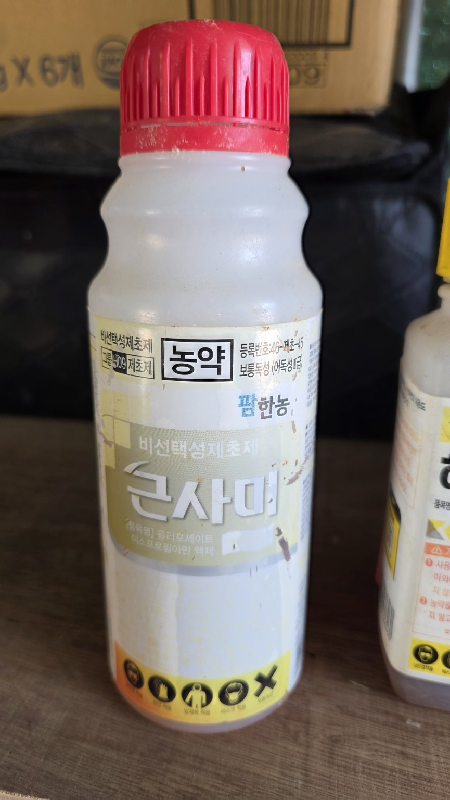
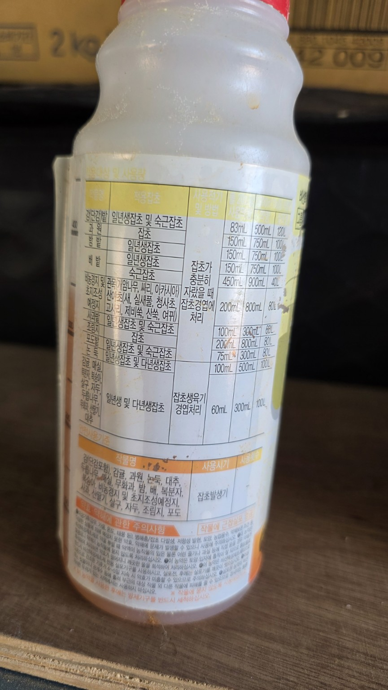
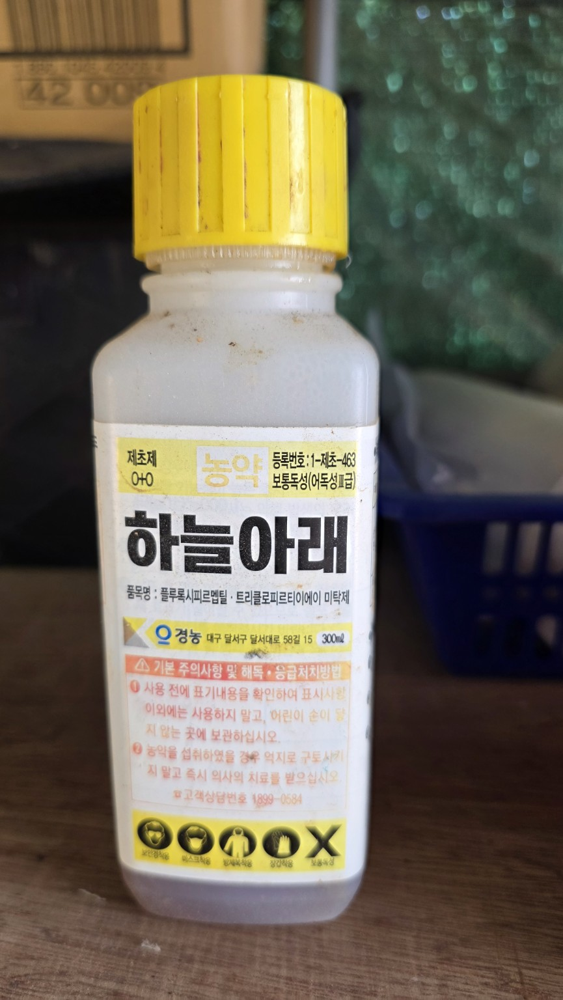
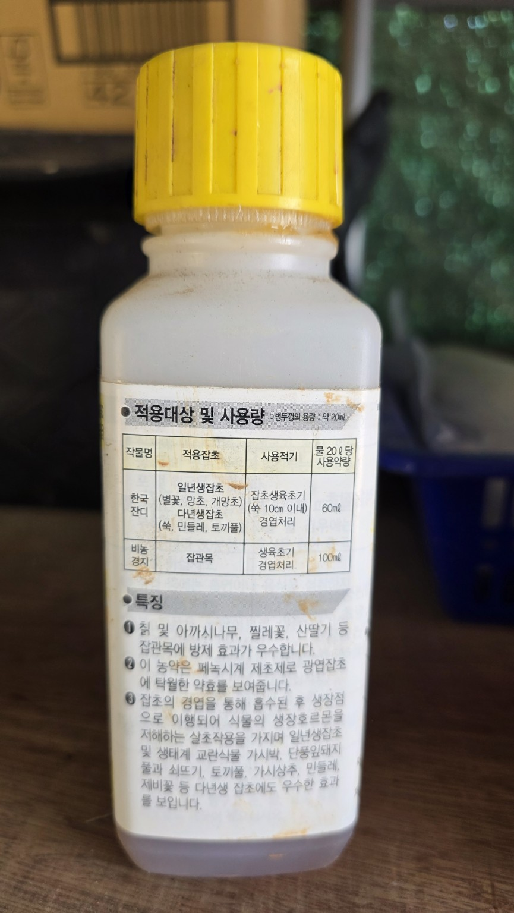
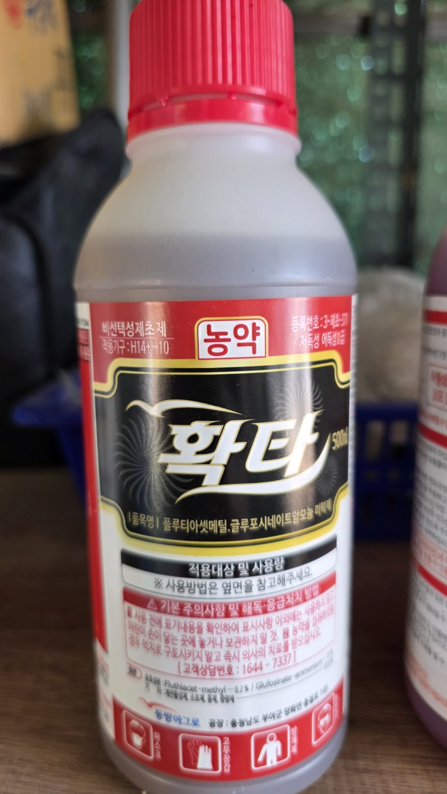
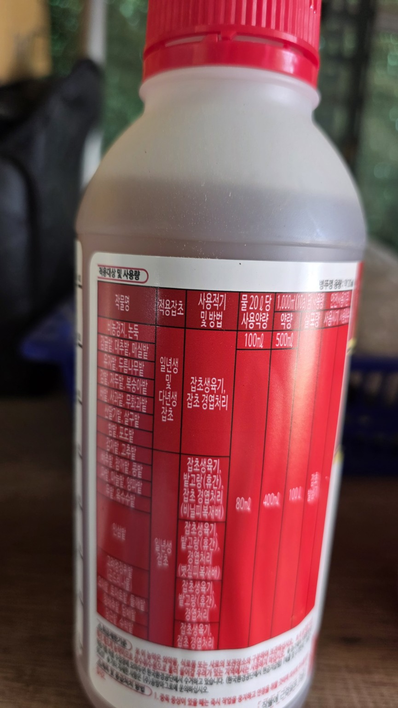
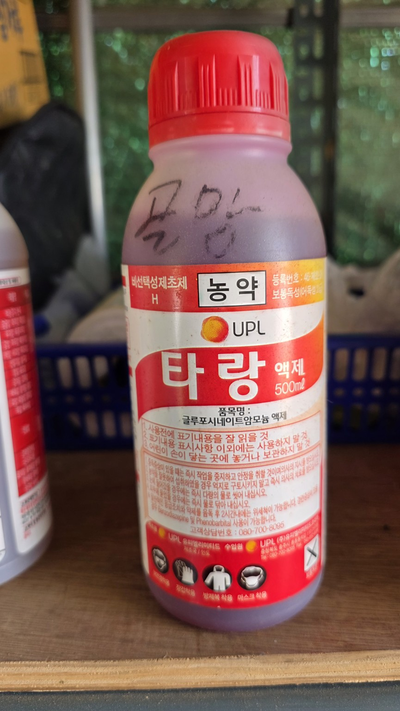
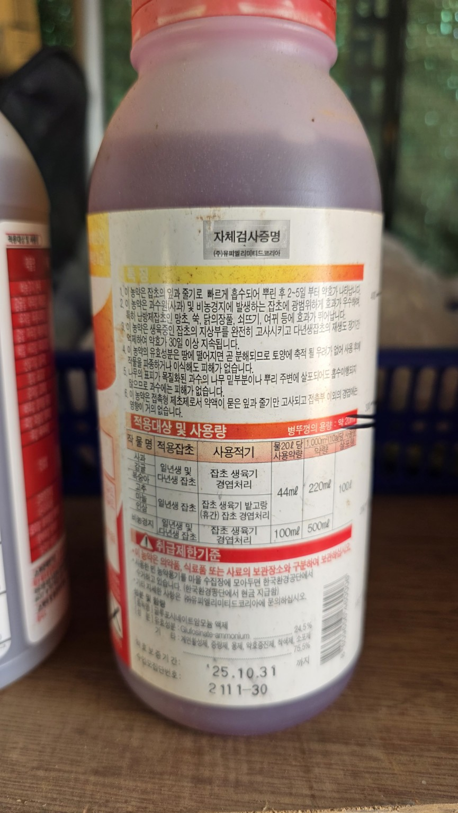

# 화곡농장 보유 농약 관리대장

> 사진 8장(4제품 × 앞·뒷면), 2026-06-05 농약사 상담 원문 포함. 사진을 누르면 원본을 확인할 수 있습니다.  
> **주의:** 제품 등록사항은 변경될 수 있으므로 실제 살포 전 병 라벨 및 농약안전정보시스템에서 작물·장소·대상잡초·사용량을 확인하세요. 감자·엄나무·들깨 등 재배작물에 비선택성 제초제가 닿지 않도록 하세요.

## 보유 농약 목록

| 제품 | 유효성분(사진 표기 기준) | 성질 | 주요 용도 | 제품 사진 (앞면·뒷면) |
|---|---|---|---|---|
| **큰사미** | 글리포세이트 이소프로필아민염 | 비선택성 / 이행성 | 다년생 잡초 경엽처리 |   |
| **하늘아래** | 플루록시피르멥틸 + 트리클로피르트리에틸아민 | 광엽·목본 잡초 대상 / 이행성 | 칡·찔레 등 등록 잡초 |   |
| **확타** | 플루티아세트메틸 + 글루포시네이트암모늄 | 비선택성 / 접촉작용 중심 | 생육 중 잡초 경엽처리 |   |
| **타랑** | 글루포시네이트암모늄 | 비선택성 / 접촉작용 중심 | 생육 중 잡초 경엽처리 |   |

## 제초제 용어

| 용어 | 의미 |
|---|---|
| 비선택성 | 잡초와 작물을 가리지 않고 식물에 피해를 줄 수 있음 |
| 선택성 | 특정 잡초군에 효과가 크다는 뜻이며 모든 작물에 안전하다는 뜻은 아님 |
| 이행성 | 흡수된 약제가 식물 내부의 다른 부위로 이동함 |
| 접촉작용 중심 | 약액이 닿은 부위에서 주로 작용하나 작물 약해 위험은 있음 |

## 2026-06-05 농약사 상담 기록

- 상담 장소: 대산읍 한국농약사(녹취 파일명 기준).
- 상황: 감자밭 가장자리 및 엄나무 주변 잡초를 예초한 뒤 제초제 사용 검토.
- 상담 요지: 농약사는 보유 제품을 작물 주변에 사용하는 것은 약해 우려가 있다며 프리타·프렌장으로 들리는 제품을 언급함. 정확한 제품명과 등록사항은 별도 확인 필요.
- 농약사는 정식 전 사용 후 한 달 정도 기다리라는 의견도 제시했으나, 이는 모든 제품에 공통 적용되는 법정 대기기간으로 단정할 수 없음.
- **기술적 보충:** 타랑의 글루포시네이트는 글리포세이트보다 접촉작용이 강한 편이지만, 그렇다고 감자·엄나무 주변에 무조건 사용 가능한 것은 아님. 제품별 등록사항과 비산 위험을 확인해야 함.

## 강우 및 사용 주의

- 살포 다음 날 비가 오더라도 무조건 재살포하지 말고 제품 라벨의 내우성 안내와 잡초 반응을 확인.
- 예초 직후에는 잎 면적이 부족하여 경엽처리 효과가 떨어질 수 있음.
- 약제를 임의 혼용하지 말고 보호구를 착용하며 배수로·인접 작물로 비산하지 않도록 주의.

## 출처

- 사용자 제공 제품 앞·뒷면 사진 8장
- `농약사_상담원문.txt` (2026-06-05 통화 녹취 전사)
