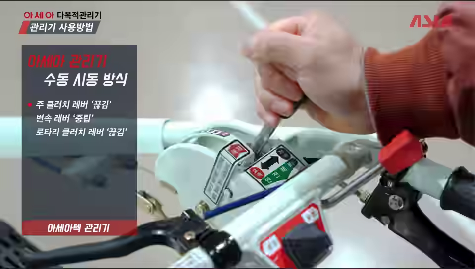
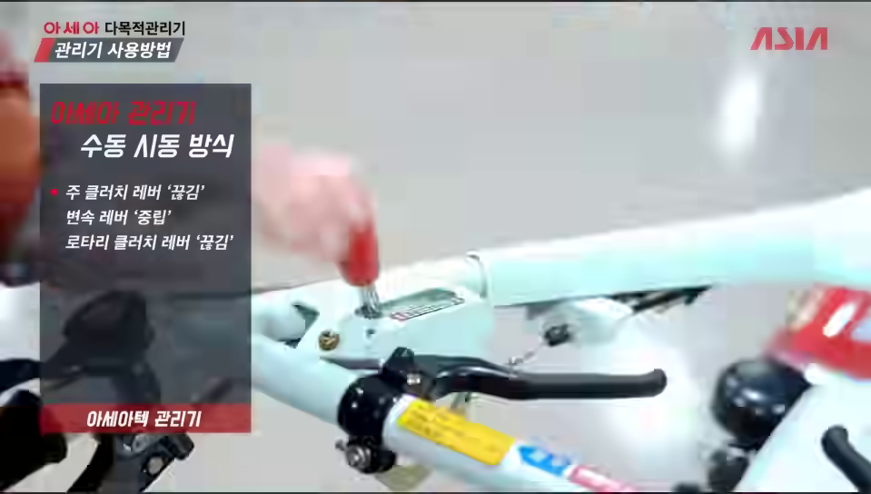
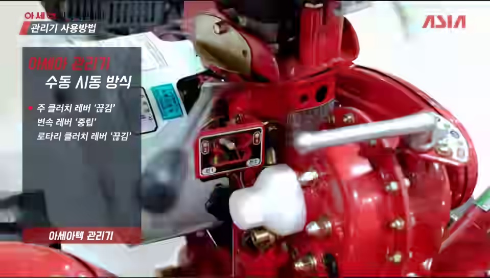
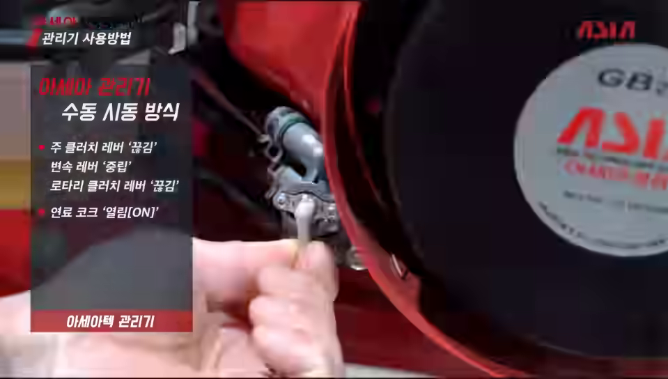
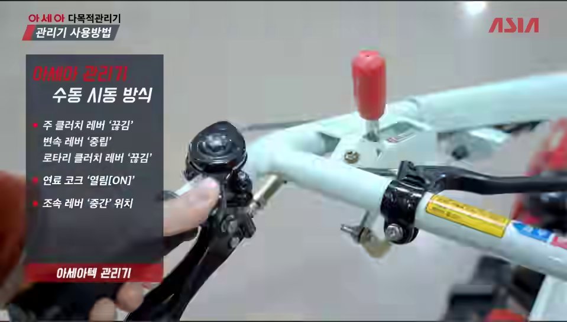
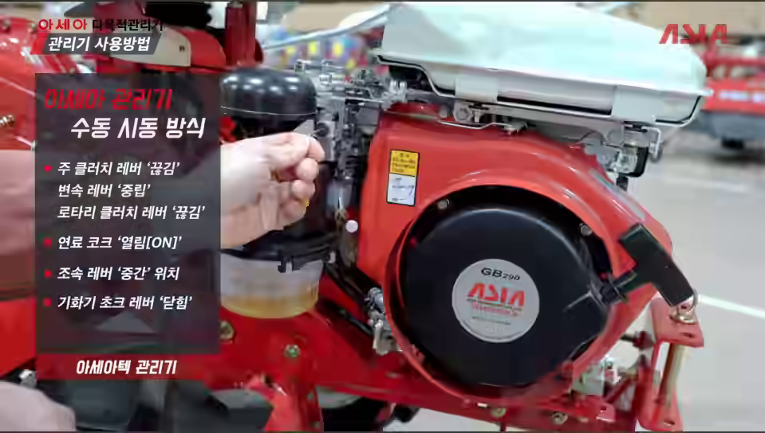
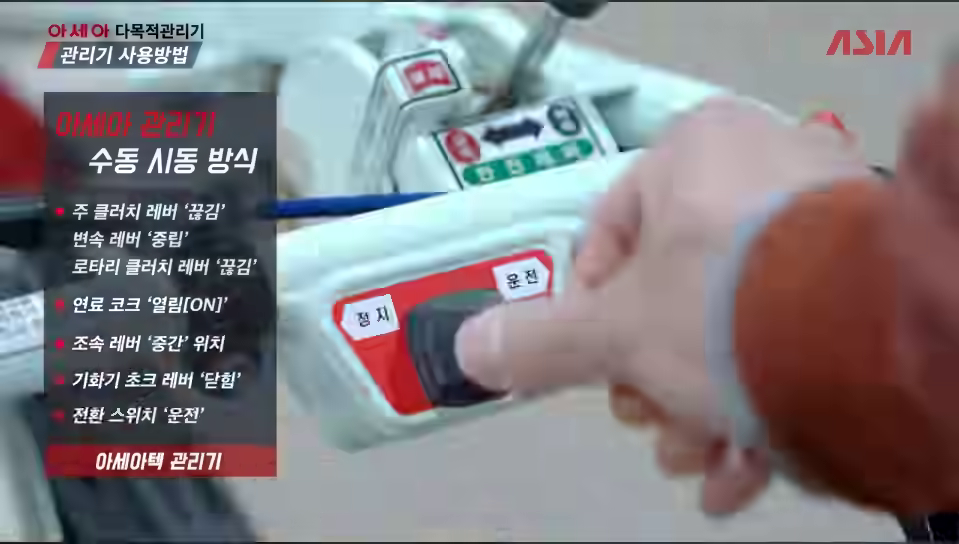
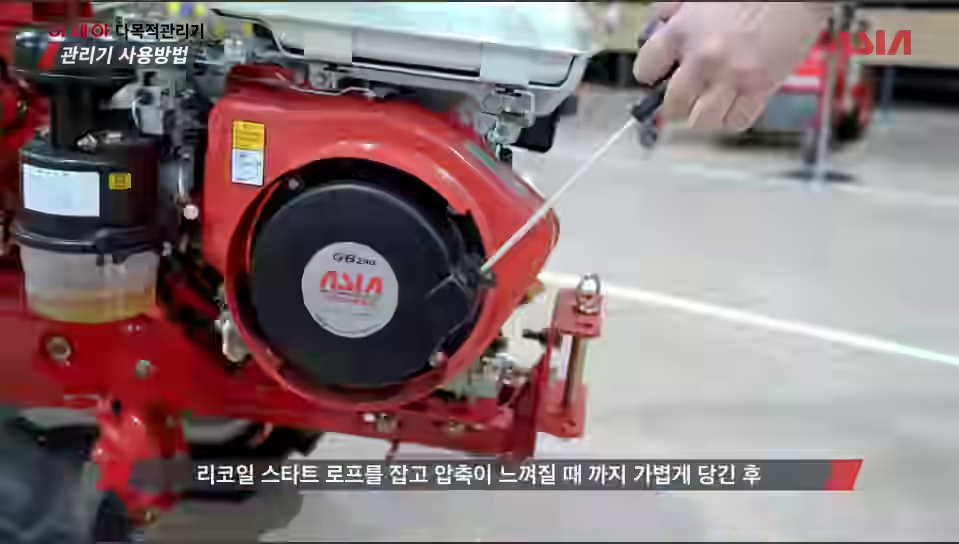
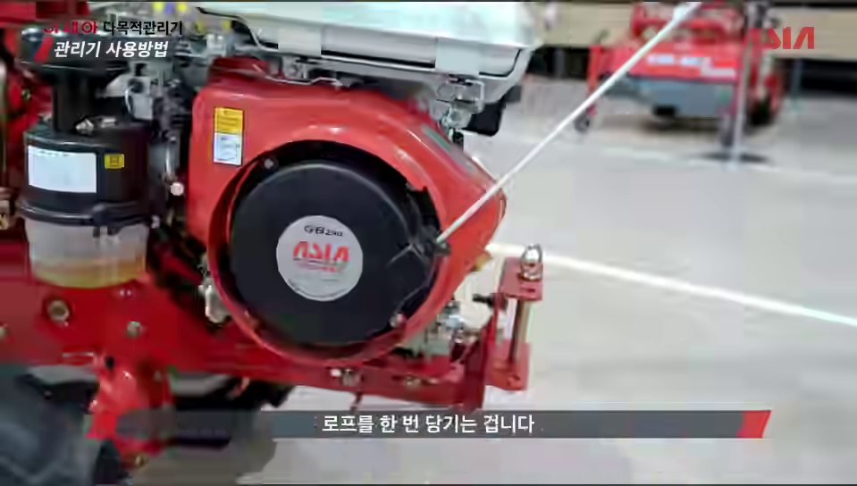
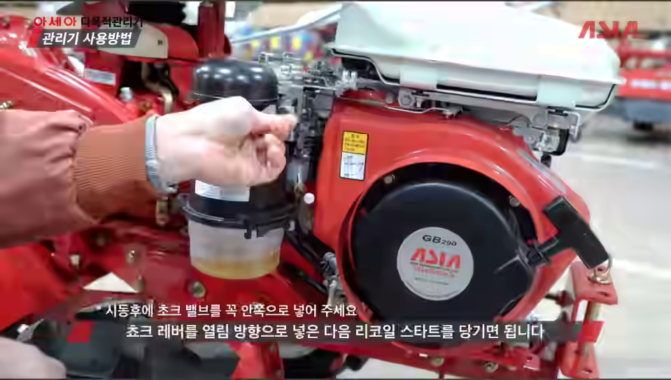

# 2026-09-22 관리기 수동시동

화곡.농장 · 농기계 공부 · 정리일 2026-09-22

사용자가 제공한 아세아 관리기 교육영상 캡처 10장과 후속 초크 질문을 정리했습니다. 엔진 덮개에서 GB290 표기는 확인되지만 관리기 본체 모델명은 확정하지 않았습니다.

## 시동 건 다음에 초크를 닫나요?

**아니요. 시동 후에는 초크를 ‘열림’으로 되돌립니다. 사진 속 조작부에서는 레버를 안쪽으로 넣는 동작이 ‘열림’입니다.**

사진 10 자막: “시동후에 초크 밸브를 꼭 안쪽으로 넣어 주세요”. 레버를 넣는 동작과 초크를 닫는 것을 혼동하지 않습니다.

[원본 교육영상](https://www.youtube.com/watch?v=POKGZK2ds34)

## 수동 시동 순서

| 순서 | 조작부 | 설정·행동 |
|---:|---|---|
| 01 | 주클러치 레버 | 끊김 |
| 02 | 로터리 클러치 레버 | 끊김 |
| 03 | 변속레버 | 중립 |
| 04 | 연료코크 | 열림(ON) |
| 05 | 조속레버 | 중간 |
| 06 | 기화기 초크레버 | 닫힘 |
| 07 | 전환 스위치 | 운전 |
| 08 | 리코일 스타트 로프 | 압축 저항이 느껴질 때까지 가볍게 당김 |
| 09 | 리코일 스타트 로프 | 이어서 시동을 위한 당김 |
| 10 | 기화기 초크레버 | 시동 후 안쪽으로 넣어 열림으로 복귀 |

01–03은 모두 시동 전에 확인할 상태입니다. 사진 08과 09는 ‘준비 당김 → 시동 당김’을 설명하며 반드시 두 번 시동을 시도하라는 뜻은 아닙니다.

## 사진별 설명

### 01. 주클러치 끊김

주클러치 레버를 ‘끊김’으로 둡니다. 시동 전 동력 전달을 끊어 놓는 단계입니다.

### 02. 로터리 클러치 끊김

로터리 클러치도 ‘끊김’으로 둡니다. 주클러치와 별도로 확인합니다.

### 03. 변속 중립

변속레버를 ‘중립’에 둡니다. 사진 각도만으로 위치를 추정하지 말고 실제 기체 안내판을 확인합니다.

### 04. 연료코크 열림

연료코크를 ‘열림(ON)’으로 돌립니다. 초크와 다른 조작부입니다.

### 05. 조속 중간

교육 화면에 표시된 대로 조속레버를 ‘중간’ 위치에 둡니다. 변속레버의 ‘중립’과 다릅니다.

### 06. 초크 닫힘

첨부 교육자료의 시동 순서는 기화기 초크레버를 ‘닫힘’으로 놓고 시작합니다.

### 07. 스위치 운전

전환 스위치를 ‘운전’에 둡니다. 같은 스위치의 ‘정지’ 표시도 함께 확인합니다.

### 08. 압축 저항 확인

리코일 스타트 손잡이를 잡고 압축 저항이 느껴질 때까지 가볍게 당깁니다.

### 09. 시동 당김

준비 당김 다음 실제 시동을 위한 당김으로 이어집니다.

### 10. 시동 후 초크 열림

시동 후 초크를 안쪽으로 넣어 ‘열림’으로 되돌립니다. 파일명과 화면 자막에는 시동이 안 될 때 초크를 열림 쪽으로 놓고 다시 당기는 안내도 포함되어 있습니다.

## 초크 상태 비교

| 상황 | 초크 상태 | 이 자료 속 조작부 |
|---|---|---|
| 교육자료의 시동 준비 | 닫힘 | 바깥으로 당긴 상태 |
| 시동 후 | 열림 | 안쪽으로 넣음 |
| 정상 운전 | 열림 유지 | 안쪽으로 넣어 둠 |

‘안쪽’이라는 방향은 사진 속 조작부 기준입니다. 다른 엔진에 방향을 그대로 적용하지 않습니다.

## 정지 — 기존 대화의 보충 설명

**이번 캡처 10장은 수동 시동 장면이며, 정지 순서를 촬영한 자료는 아닙니다.** 다음은 기존 대화에서 구분해 둔 보충 설명입니다. 실제 기체 표시와 전용 설명서를 우선합니다.

동력 끊기 → 기계가 멈춘 뒤 중립 → 조속 저속 → 전환 스위치 정지 → 엔진 정지 후 연료코크 닫힘.

사진 07은 ‘운전’ 조작 장면입니다. 같은 스위치의 ‘정지’ 위치를 찾는 데만 참고하며 정지 장면으로 표시하지 않습니다.

일반 엔진 정지와 초크·시동줄 관련 보충 참고: [Honda GX120·GX160·GX200 설명서](https://www.honda-engines-eu.com/files/files/owners-manual-gx120-160-200-ut1-english-32z4f605.pdf). 사진 속 GB290 전용 설명서가 아닙니다.

## 자료 안내

수동 시동 설명의 기준은 사용자가 첨부한 캡처 10장입니다. 원본 동영상 파일은 첨부되지 않았으며 위 YouTube 원본 링크로 연결합니다.

이 공개 웹판의 사진은 첨부 이미지에서 만든 동일 해상도의 웹 최적화본입니다. PNG 원본의 바이트와 동일한 파일이라고 표시하지 않습니다. 원본 PNG 10장과 기존 이미지 내장 HTML은 대화의 원본 ZIP에 보존되어 있습니다.

[화곡농장 홈](https://softm.github.io/hwagok-farm/) · [전체 프로젝트](https://softm.github.io/projects/) · [비공개 사이트](https://hwagok-farm-private.vercel.app/)
