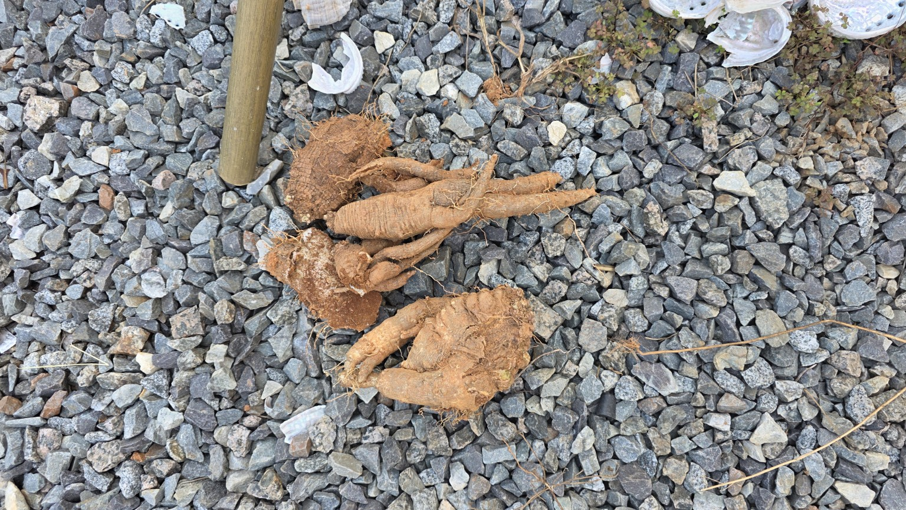
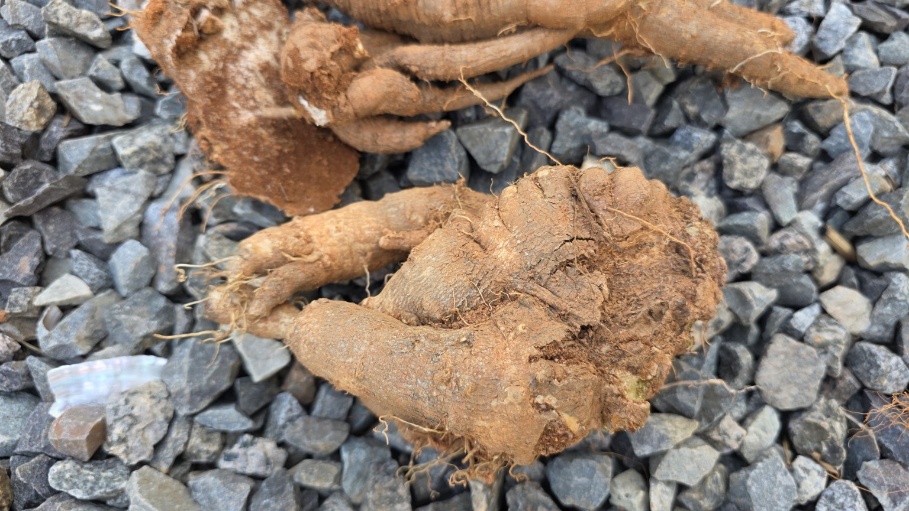

# 2026-09-23 화곡농장 더덕 수확 및 더덕 씨앗 채취

## 작업 개요

| 항목 | 기록 |
|---|---|
| 작업일 | 2026년 9월 23일 — 사용자 제공 |
| 장소 | 화곡농장 — 사용자 제공 |
| 작업 | 더덕 수확 및 더덕 씨앗 채취 관련 기록 |
| 사진 | 원본 JPG 7장 |
| 영상 | 원본 MP4 3개 + 웹 재생용 H.264 사본 3개 |
| 파일명에 나타난 시각 | 12:47:11~13:54:45 — 실제 작업 소요시간은 알 수 없음 |
| 미기록 | 수확량, 정확한 개수, 연근, 실측 크기, 정확한 필지, 종자 분리·건조 완료 여부 |

## 기록의 근거와 범위

사용자가 제공한 작업명과 첨부 사진·영상에서 확인되는 내용으로 정리했습니다. 파일명을 촬영 순서의 기준으로 사용했습니다. JPG의 촬영 일시 EXIF는 확인되지 않았으므로 파일명 시각을 실제 작업 시작·종료 시각으로 단정하지 않습니다. 원본 영상 3개는 각각 약 3.12초, 1.92초, 1.30초인 짧은 기록이며 원본의 길이를 임의로 늘리지 않았습니다.

## 1. 채취한 더덕 삭과 — 12:47:11

용기에 잎·줄기와 함께 모아 둔 더덕 삭과를 기록했습니다. 녹색과 갈색 부분이 함께 보입니다. **사진은 삭과를 모아 둔 상태이며, 분리된 종자 자체나 종자 성숙·발아를 확인한 기록은 아닙니다.**

## 2. 뿌리 굴취 현장 — 12:47:13~12:47:29

영상 12:47:13은 주변 식생에서 흙을 파낸 자리로 화면이 이동합니다. 영상 12:47:25와 사진 12:47:28·29에는 붉은 흙 사이에서 드러난 굵은 뿌리가 보입니다. 일부 뿌리는 여러 갈래로 분지해 있습니다. **12시대에도 이미 뿌리 굴취 현장이 기록되어 있습니다.**

[현장 영상 12:47:13 원본](videos/20260923_124713.mp4) · [재생용](playback/20260923_124713_h264.mp4)

[노출된 뿌리 영상 12:47:25 원본](videos/20260923_124725.mp4) · [재생용](playback/20260923_124725_h264.mp4)

## 3. 수확물 정리·근접 기록 — 13:54:37~13:54:45

자갈 바닥에 놓인 수확물의 전체 모습과 굵은 부분, 길쭉하게 뻗은 부분, 여러 갈래로 나뉜 형태를 사진과 영상으로 남겼습니다. 표면에 흙과 잔뿌리 등이 보입니다. 사진만으로 정확한 중량·길이·재배 연수·상품성·병해 여부를 판단하지 않습니다.

[수확물 영상 13:54:39 원본](videos/20260923_135439.mp4) · [재생용](playback/20260923_135439_h264.mp4)

## 촬영 자료 전체 목록

| 파일명 기준 시각 | 구분 | 원본 파일 | 확인 내용 | 크기 |
|---|---|---|---|---|
| 12:47:11 | 사진 | [20260923_124711.jpg](images/20260923_124711.jpg) | 채취한 더덕 삭과 | 0.43 MB |
| 12:47:13 | 영상 | [20260923_124713.mp4](videos/20260923_124713.mp4) | 주변 식생에서 굴취 자리로 | 4.29 MB |
| 12:47:25 | 영상 | [20260923_124725.mp4](videos/20260923_124725.mp4) | 드러난 뿌리의 현장 영상 | 2.39 MB |
| 12:47:28 | 사진 | [20260923_124728.jpg](images/20260923_124728.jpg) | 흙에서 드러난 더덕 뿌리 | 0.49 MB |
| 12:47:29 | 사진 | [20260923_124729.jpg](images/20260923_124729.jpg) | 굴취 현장 가까이 보기 | 0.41 MB |
| 13:54:37 | 사진 | [20260923_135437.jpg](images/20260923_135437.jpg) | 수확한 더덕 전체 모습 | 0.67 MB |
| 13:54:39 | 영상 | [20260923_135439.mp4](videos/20260923_135439.mp4) | 수확물의 전체와 근접 모습 | 1.75 MB |
| 13:54:41 | 사진 | [20260923_135441.jpg](images/20260923_135441.jpg) | 길게 뻗은 뿌리와 분지 | 0.46 MB |
| 13:54:42 | 사진 | [20260923_135442.jpg](images/20260923_135442.jpg) | 같은 수확물의 다른 사진 | 0.50 MB |
| 13:54:45 | 사진 | [20260923_135445.jpg](images/20260923_135445.jpg) | 굵은 분지부 근접 기록 | 0.40 MB |

## 확인되지 않은 사항

| 항목 | 기록 상태 |
|---|---|
| 수확 중량·정확한 수량 | 계측 자료 없음 |
| 재배 연수·실측 길이와 직경 | 자료 없음 |
| 정확한 작업 필지 | 이 채팅에 지정되지 않음 |
| 종자 분리·건조 완료 | 확인 자료 없음 |
| 종자 성숙·발아율 | 사진과 짧은 영상만으로 확인 불가 |

## 이전 설명 정정

이전 공개 페이지에서 12:47:28·29 사진을 '삭과 근접'으로 설명한 부분은 잘못된 분류입니다. 실제로는 흙에서 드러난 뿌리 사진입니다. 12:47:25 영상도 같은 뿌리 현장입니다. 12:47:13 영상은 주변 식생에서 굴취 자리로 이동합니다. 따라서 '12시대 씨앗 채취 → 13시대 굴취 시작'이라는 작업 순서도 확정하지 않습니다.

초기에 생성했던 MD·HTML은 `source-documents/`에 변경 없이 따로 보존했습니다. 현장에서 확인되지 않은 채종·건조·보관 조언을 새 기록의 사실로 옮기지는 않았습니다.

## 원본 보존·열람

사진 7장과 영상 3개는 파일명과 파일 바이트를 그대로 보존했습니다. 원본과 현재 파일의 SHA-256 대조 결과는 `record.json`과 `checksums.sha256`에서 확인할 수 있습니다. 웹 플레이어에는 H.264/AAC 재생용 사본을 연결하고 HEVC 원본 MP4 다운로드를 따로 제공했습니다.

압축을 푼 뒤 `record.html`을 브라우저에서 열면 사진 확대와 영상 재생 기능을 사용할 수 있습니다. `index.html`도 동일한 문서입니다. 온라인의 전체 ZIP 버튼은 배포 시 같은 폴더에 놓이는 `bundle.zip`을 대상으로 하며, 로컬 파일로 볼 때는 표시하지 않습니다.
