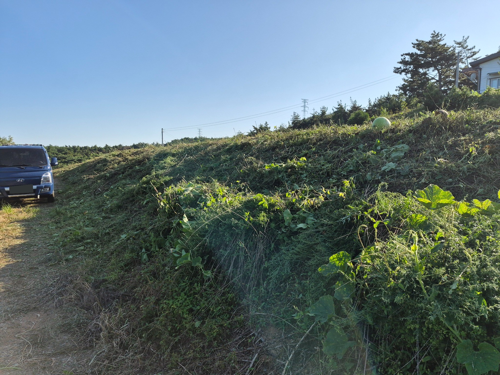
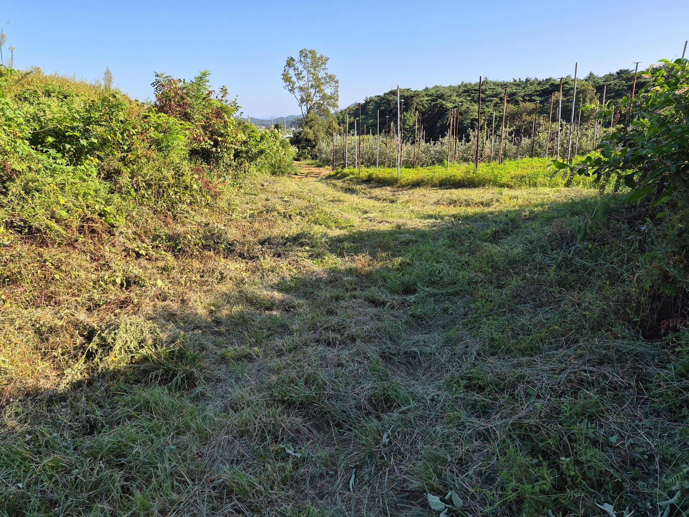
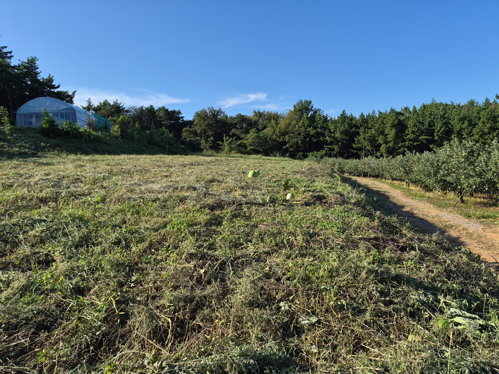

# 2026년 9월 7일 화곡농장 벌초 작업 기록

## 1. 작업 개요

| 항목 | 기록 |
|---|---|
| 프로젝트 | 화곡농장 |
| 작업일 | 2026년 9월 7일 |
| 작업 내용 | 벌초·풀베기 |
| 작업자 관련 메모(사용자 원문) | 호경당숙 같은 교회 사람 |
| 시작 시각 | 08:30 |
| 종료 시각 | 17:00 |
| 시작부터 종료까지 | 8시간 30분(510분) |
| 점심·휴게시간 | 미확인 — 위 시간에서 차감하지 않음 |
| 작업 인원·면적·인건비 | 미확인 |
| 첨부 현장 사진 | 3장 |

작업자 관련 메모는 사용자 표현을 그대로 보존했습니다. 작업자의 실명·정확한 인원과 호경 당숙의 작업 참여 여부는 이 기록만으로 확정하지 않습니다.

## 2. 사진에서 확인되는 상태

사진에 보이는 범위만 기술했으며, 전체 작업 면적·완료율·작업 품질은 사진 3장만으로 판단하지 않았습니다.

| 사진 | 구역 | 관찰 내용 |
|---|---|---|
| 01 | 통로 옆 경사면 | 차량 옆 경사면에 풀이 베어진 흔적이 보이며, 잘린 풀과 덩굴이 비탈에 남아 있습니다. |
| 02 | 재배 구역 옆 통로 | 지주대가 설치된 재배 구역 옆 통로에 풀베기 흔적이 보이고, 바닥에 잘린 풀이 깔려 있습니다. |
| 03 | 하우스가 보이는 밭 | 하우스가 보이는 넓은 구역에 풀베기 흔적이 있으며, 잘린 풀과 일부 덩굴·열매가 남아 있습니다. |

## 3. 현장 사진

아래 사진은 한 줄에 3장으로 배치했습니다. HTML 문서에서는 사진을 누르면 확대 팝업이 열립니다.

<table><tr>
<td width="33%"> <strong>통로 옆 경사면</strong></td>
<td width="33%"> <strong>재배 구역 옆 통로</strong></td>
<td width="33%"> <strong>하우스가 보이는 밭</strong></td>
</tr></table>

## 4. 기록 근거와 공개 처리

사용자 제공 메모:

> 2026년09월07일 벌초 호경당숙 같은 교회 사람 8시30분 ~ 17시까지

이 문서는 위 메모와 같은 대화에 첨부된 사진 3장을 기준으로 정리했습니다. 시작·종료 시각 차이는 계산값이며, 실작업시간은 휴게시간이 확인되지 않아 산정하지 않았습니다.

공개용 사진 1의 차량 번호판을 가렸고, 사진 3장의 EXIF 등 촬영 메타데이터를 제거했습니다. 원본 사진은 공개 ZIP과 저장소에 포함하지 않습니다. 본문과 사진 설명 외에 작업 인원·면적·비용 또는 다른 작업일의 정보는 추가하지 않았습니다.

| 사진 | 첨부 원본 파일명 | 공개용 파일 |
|---|---|---|
| 01 | KakaoTalk_Photo_2026-09-07-21-46-19.jpeg | images/01-slope.jpg |
| 02 | KakaoTalk_Photo_2026-09-07-21-46-17.jpeg | images/02-path.jpg |
| 03 | KakaoTalk_Photo_2026-09-07-21-46-15.jpeg | images/03-field.jpg |

## 5. 관련 링크

[벌초 기록 공개 페이지](https://softm.github.io/hwagok-farm/mowing-20260907/) · [화곡농장 공개 홈](https://softm.github.io/hwagok-farm/) · [전체 프로젝트](https://softm.github.io/projects/) · [화곡농장 비공개 홈](https://hwagok-farm-private.vercel.app/) · [GitHub 저장소](https://github.com/softm/hwagok-farm)
