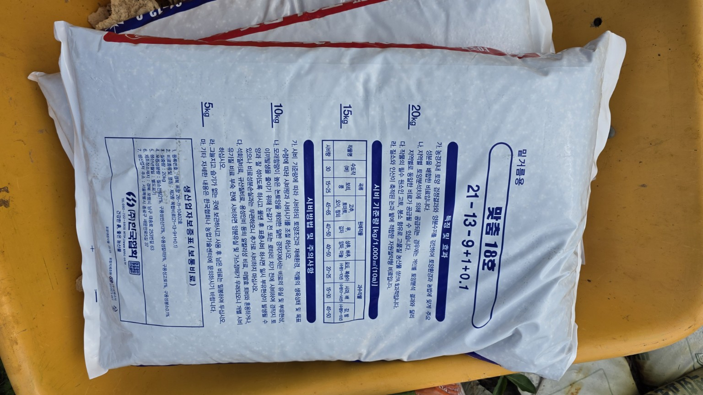
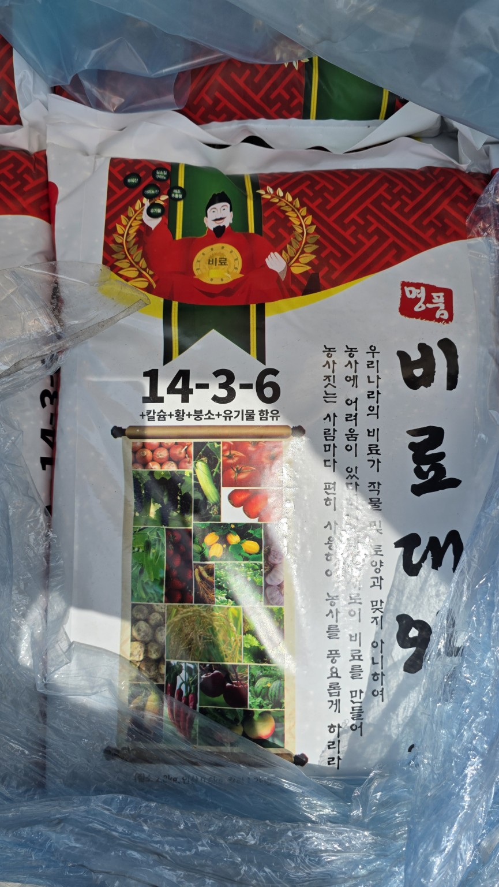
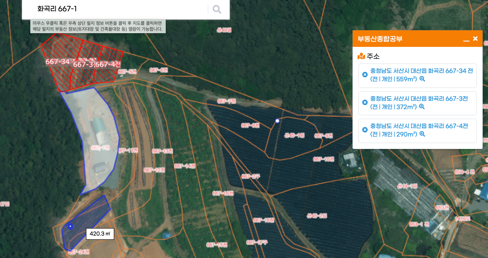
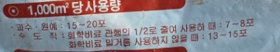

# 화곡농장 들깨·열무 밑거름 시비 계획

**기록일:** 2026년 7월 5일

## 대상 필지 및 작물

| 필지 | 면적 | 평수 | 작물 |
|---|---:|---:|---|
| 667-34 | 559㎡ | 약 169.1평 | 들깨 |
| 667-3 | 372㎡ | 약 112.5평 | 들깨 |
| 아래 밭 | 420.3㎡ | 약 127.1평 | 들깨 |
| 667-4 | 290㎡ | 약 87.7평 | 열무 |
| **합계** | **1,641.3㎡** | **약 496.5평** | |

## 맞춤18호
맞춤18호는 **21-13-9 + 붕소** 계열의 복합비료로 현재 계획에서는 **밑거름용**으로 사용합니다.

| 필지 | 작물 | 면적 | 맞춤18호 | 포대 환산 |
|---|---|---:|---:|---:|
| 667-34 | 들깨 | 559㎡ | **30kg** | **1.5포** |
| 667-3 | 들깨 | 372㎡ | **20kg** | **1포** |
| 아래 밭 | 들깨 | 420.3㎡ | **25kg** | **1.25포** |
| 667-4 | 열무 | 290㎡ | **25kg** | **1.25포** |
| **합계** |  | **1,641.3㎡** | **100kg** | **5포** |

> 들깨는 질소가 과하면 웃자람과 도복 위험이 있으므로 추가 질소비료는 생육을 보고 결정합니다.

## 비황골드
비황골드는 20kg 포대이며, 포대 표기상 **과수·원예 1,000㎡당 15~20포** 사용량이 적혀 있습니다.

맞춤18호와 함께 사용할 때는 각 제품 권장량을 단순 합산하기보다 토양상태, 전작, 기존 퇴비 투입량 등을 함께 고려하는 것이 안전합니다.

## 명품비료
사진에서 확인한 명품비료는 **14-3-6** 계열이며 칼슘·황·붕소·유기물 함유 표시가 있습니다.

맞춤18호와 동시에 충분량을 중복 투입하면 총 질소량이 과해질 수 있으므로 대체 또는 보완용으로 보는 편이 좋습니다.

## 트랙터 로터리 전 살포 방법
1. 필지별로 사용할 양을 먼저 나눕니다.
2. 비황골드와 맞춤18호를 밭 전체에 최대한 균일하게 뿌립니다.
3. 절반은 한 방향, 나머지 절반은 직각 방향으로 뿌리면 편차를 줄이기 좋습니다.
4. 한곳에 몰아서 쏟지 않습니다.
5. 살포 후 트랙터 로터리로 흙과 충분히 섞습니다.
6. 이후 두둑을 만들고 작물별 파종·정식을 진행합니다.

## 대산농협 구매 메모
- 맞춤18호 조합원 가격
- 비황골드 조합원 가격
- 명품비료 조합원 가격
- 일반 판매가와 조합원가 차이
- 지원·계통비료 여부
