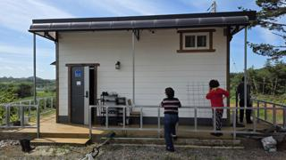
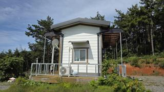
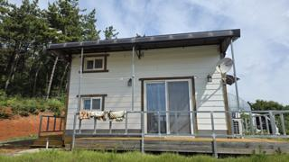
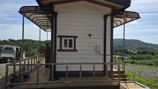
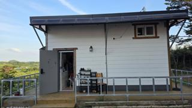
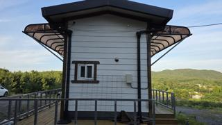
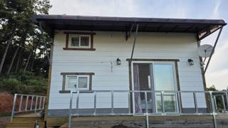
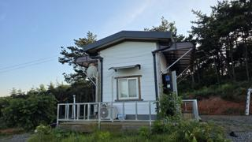

# 20260711_농막_차양막_거치대_대각선보강_수리

## 작업 개요
- 작업일: 2026-07-11
- 작업 내용: 차양막 거치대를 대각선 보강대로 농막 구조체에 고정하여 강성을 높이고 흔들림을 줄이는 보강 작업.

## 작업 전
| 1 | 2 | 3 |
|---|---|---|
||||
||||

## 작업 내용
- 기존 수직 지지 구조만으로는 횡방향 흔들림 우려.
- 대각선 보강대를 추가 설치하여 하중 분산.
- 농막 벽체 방향으로 견고하게 고정.

## 작업 후
| 1 | 2 | 3 |
|---|---|---|
||||
||||

## 결과
- 차양막 구조 강성 향상
- 바람에 의한 흔들림 감소 기대
- 장기적인 처짐 및 변형 방지
