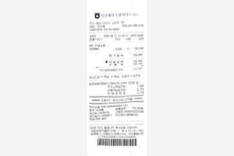
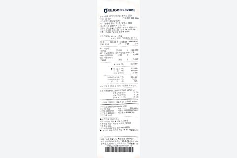
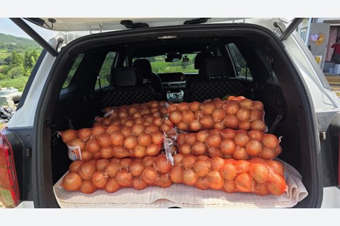
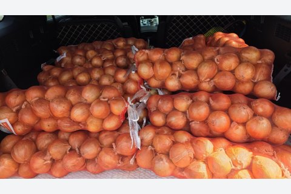
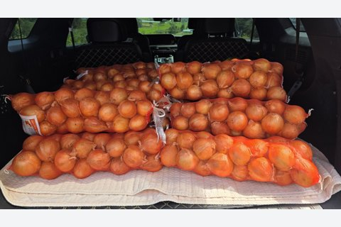
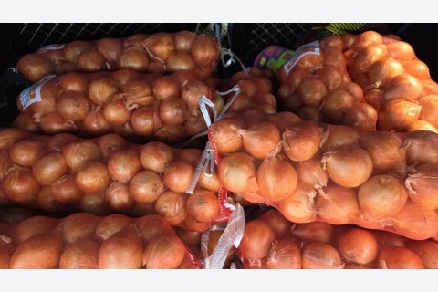
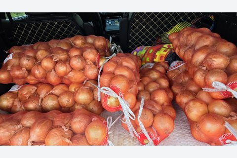

# 2026-08-11 화곡농장 양파 구입 및 저온창고 보관 기록

## 1. 작업 개요

- **일자:** 2026-08-11
- **내용:** 양파 구입 → 차량 적재·운반 → 화곡농장 저온창고 보관
- **구입처:** 서산태안농협 하나로마트, 대산농협 하나로마트
- **양파 구입대금 합계:** **453,000원**
- **자료:** 영수증 사진 2장, 양파 적재 사진 5장, 동영상 3개

## 2. 구입 내역

| 구입처 | 영수증 시각 | 영수증상 양파 내역 | 양파 금액 | 비고 |
|---|---:|---:|---:|---|
| 서산태안농협 하나로마트 | 11:02:17 | 채소류 9,000원 × 17 | **153,000원** | 사용자가 양파 구입 건으로 기록. 영수증에는 단위 표기가 없음 |
| 대산농협 하나로마트 | 13:38:06 | 양파 1건 | **300,000원** | 영수증 전체 매출은 다른 상품을 포함해 312,080원, 실제 카드 결제 309,680원 |
| **합계** |  |  | **453,000원** | 양파 항목만 합산 |

### 수량 참고 계산

- 서산태안농협 영수증: **수량 17**
- 대산농협: 앞서 확인한 **15kg 1망 15,000원** 기준으로 계산하면 `300,000 ÷ 15,000 = 20망`
- 따라서 관리상 **약 37망**으로 볼 수 있음.
- 두 구입분이 모두 15kg 규격이라는 전제라면 약 **555kg**이지만, 서산태안농협 영수증에는 중량 규격이 표시되어 있지 않아 **참고값**으로만 기록함.

## 3. 영수증 증빙

<table>
<tr>
<td width="33%" align="center"><a href="assets/images/1000060287.jpg"> 서산태안농협 하나로마트 영수증</a></td>
<td width="33%" align="center"><a href="assets/images/1000060288.jpg"> 대산농협 하나로마트 영수증</a></td>
<td width="33%"></td>
</tr>
</table>

## 4. 차량 적재·운반 사진

<table>
<tr>
<td width="33%" align="center"><a href="assets/images/1000060105.jpg"> 차량 적재 전경 1</a></td>
<td width="33%" align="center"><a href="assets/images/1000060106.jpg"> 차량 적재 근접 1</a></td>
<td width="33%" align="center"><a href="assets/images/1000060107.jpg"> 차량 적재 전경 2</a></td>
</tr>
<tr>
<td width="33%" align="center"><a href="assets/images/1000060108.jpg"> 차량 적재 근접 2</a></td>
<td width="33%" align="center"><a href="assets/images/1000060264.jpg"> 양파 적재 상세</a></td>
<td width="33%"></td>
</tr>
</table>

## 5. 동영상 기록

| 파일 | 길이 | 내용 메모 |
|---|---:|---|
| [1000060104.mp4](assets/videos/1000060104.mp4) | 약 6.8초 | 차량에 적재된 양파 기록 |
| [1000060262.mp4](assets/videos/1000060262.mp4) | 약 5.5초 | 양파망 운반·이동 과정 기록 |
| [1000060263.mp4](assets/videos/1000060263.mp4) | 약 6.0초 | 차량 적재 상태 근접 기록 |

## 6. 보관 기록

구입한 양파는 차량으로 운반한 뒤 **화곡농장 저온창고에 보관**한 것으로 기록한다. 본 문서는 2026-08-11 당시의 영수증과 사진·동영상 자료를 기준으로 구매 및 운반 사실을 묶어 보관하기 위한 작업 기록이다.

## 7. 비용 요약

- **양파 구매비:** 453,000원
- 대산농협 영수증의 전체 카드 결제액은 **309,680원**이나, 이 중 양파 항목은 **300,000원**이므로 양파 구매비 계산에는 300,000원만 반영함.
- 서산태안농협 양파 구매 건은 **153,000원** 전액을 반영함.

## 8. 첨부 파일 목록

### 이미지
- `assets/images/1000060287.jpg` — 서산태안농협 영수증
- `assets/images/1000060288.jpg` — 대산농협 영수증
- `assets/images/1000060105.jpg`
- `assets/images/1000060106.jpg`
- `assets/images/1000060107.jpg`
- `assets/images/1000060108.jpg`
- `assets/images/1000060264.jpg`

### 동영상
- `assets/videos/1000060104.mp4`
- `assets/videos/1000060262.mp4`
- `assets/videos/1000060263.mp4`

> HTML 버전에서는 이미지와 동영상을 썸네일로 표시하며, 클릭하면 **레이어 팝업**으로 크게 볼 수 있도록 구성했다.
