# 20260905 화곡농장 열무·무 파종 기록

- **작업일:** 2026-09-05
- **원본:** `20260905_열무 무 파종(1).zip`
- **사진:** 21장
- **동영상:** 8개
- **정리 원칙:** 첨부 미디어를 단순 보관하지 않고 본문 기록에 직접 포함. 사진·영상에서 확인되지 않는 품종·파종량·간격·깊이는 추정하지 않음.

## 작업 기록 요약

이 자료는 2026년 9월 5일 화곡농장의 **열무·무 파종 작업 현장**을 사진과 동영상으로 기록한 것이다. 현장 자료에는 작업자, 멀칭 두둑, 고랑과 외곽 작업면, 파종부로 보이는 노출 토양의 근접 상태, 작업 후 포장 전체 모습이 반복적으로 담겨 있다. 특히 사진 009~010, 014~019 및 일부 영상은 토양 표면을 근접 촬영해 파종 직후 상태를 남겼고, 사진 005~008, 011~013, 020~021과 전경 영상은 두둑 배치와 작업 범위를 확인하는 증빙 자료로 활용할 수 있다.

## 사진 21장 상세 기록

### 사진 001

[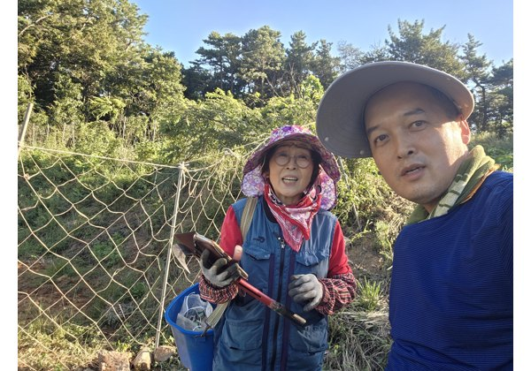](assets/images/KakaoTalk_Photo_2026-09-05-22-59-50 001.jpeg)

작업 현장에서 작업자 2명이 함께 촬영된 기록. 파종 작업 당시 인원과 현장 주변 상태 확인.

### 사진 002

[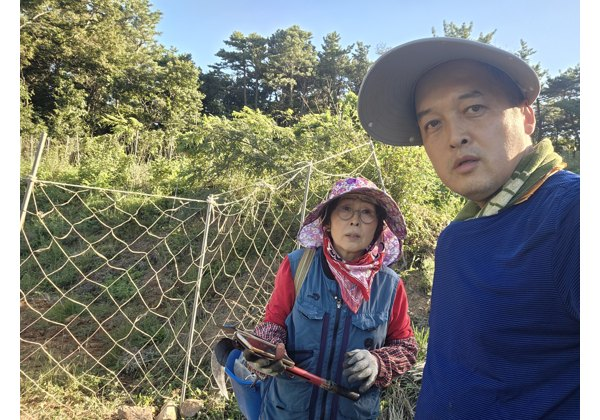](assets/images/KakaoTalk_Photo_2026-09-05-22-59-53 002.jpeg)

작업자 2명과 농작업 도구가 함께 보이는 현장 기록.

### 사진 003

[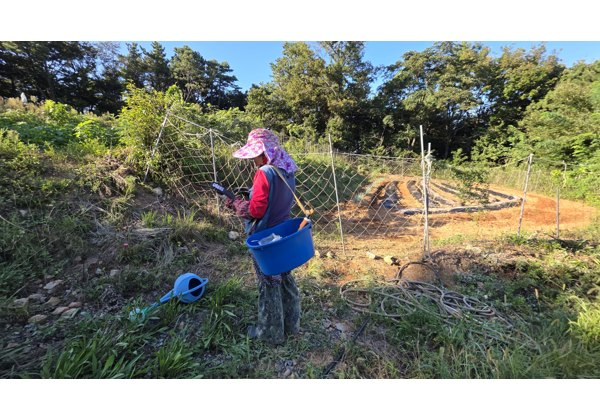](assets/images/KakaoTalk_Photo_2026-09-05-22-59-55 003.jpeg)

작업자가 파란색 통을 들고 포장 가장자리에서 작업 중인 모습.

### 사진 004

[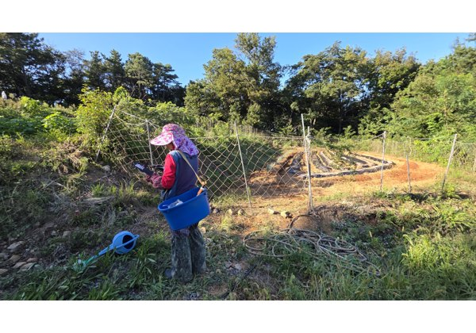](assets/images/KakaoTalk_Photo_2026-09-05-22-59-57 004.jpeg)

포장 가장자리에서 작업 중인 모습과 주변 울타리·식생 상태.

### 사진 005

[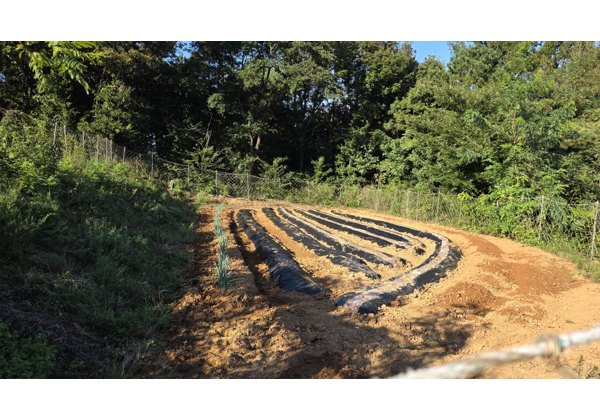](assets/images/KakaoTalk_Photo_2026-09-05-23-00-00 005.jpeg)

여러 줄의 멀칭 두둑과 주변 작업로를 포함한 포장 전체 전경.

### 사진 006

[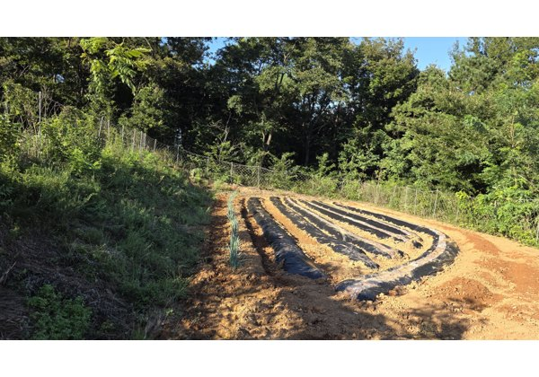](assets/images/KakaoTalk_Photo_2026-09-05-23-00-04 006.jpeg)

멀칭 두둑을 정면에서 본 전경. 두둑 배열과 포장 형태 확인.

### 사진 007

[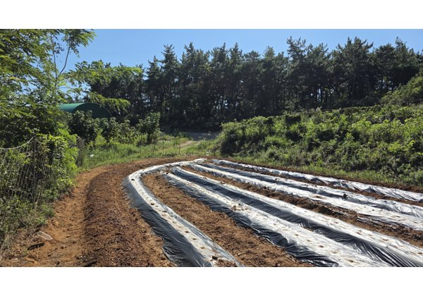](assets/images/KakaoTalk_Photo_2026-09-05-23-00-08 007.jpeg)

멀칭 두둑을 측면에서 본 전경. 고랑과 주변 토양 상태 확인.

### 사진 008

[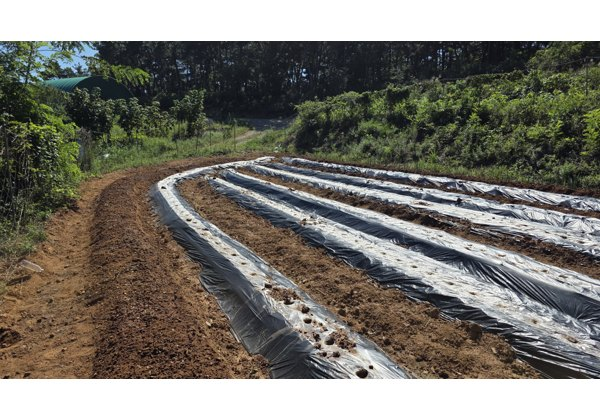](assets/images/KakaoTalk_Photo_2026-09-05-23-00-12 008.jpeg)

포장 반대 방향에서 본 멀칭 두둑 전경.

### 사진 009

[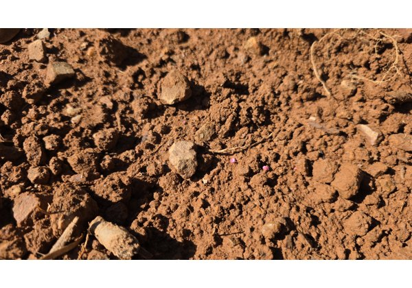](assets/images/KakaoTalk_Photo_2026-09-05-23-00-14 009.jpeg)

파종부로 보이는 노출 토양 표면의 근접 기록. 흙 입자와 수분·표면 상태 확인용.

### 사진 010

[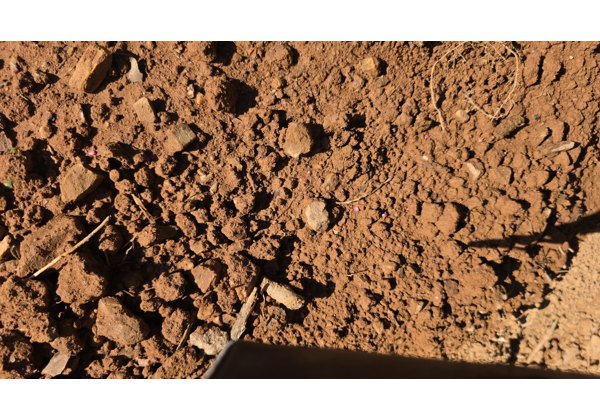](assets/images/KakaoTalk_Photo_2026-09-05-23-00-19 010.jpeg)

노출 토양의 근접 기록. 파종 후 토양 표면 상태를 자세히 남김.

### 사진 011

[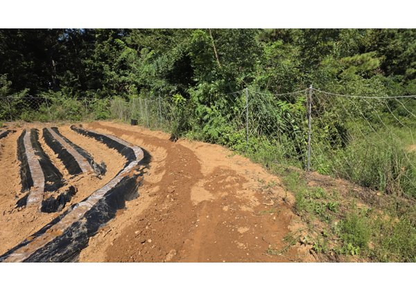](assets/images/KakaoTalk_Photo_2026-09-05-23-00-24 011.jpeg)

멀칭 두둑 끝부분과 바깥쪽 작업면을 함께 촬영한 기록.

### 사진 012

[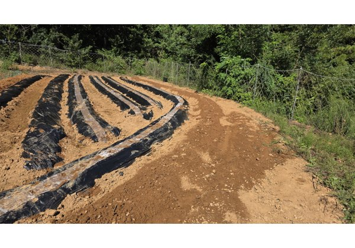](assets/images/KakaoTalk_Photo_2026-09-05-23-00-28 012.jpeg)

포장 전체를 높은 위치에서 본 전경. 멀칭 두둑과 바깥 작업면 확인.

### 사진 013

[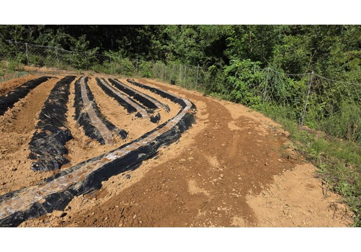](assets/images/KakaoTalk_Photo_2026-09-05-23-00-32 013.jpeg)

멀칭 두둑의 곡선 배치와 포장 외곽 작업면 전경.

### 사진 014

[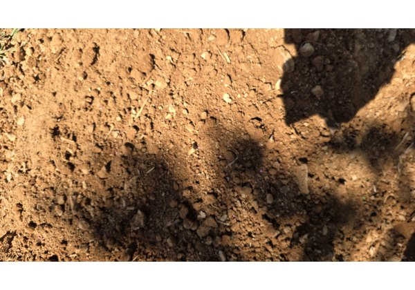](assets/images/KakaoTalk_Photo_2026-09-05-23-00-33 014.jpeg)

노출 토양 근접 사진. 표면의 흙덩이와 입도 상태 기록.

### 사진 015

[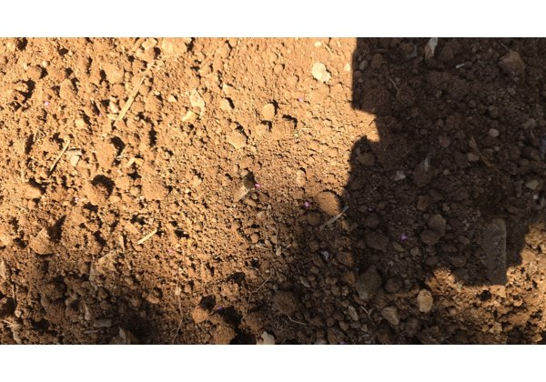](assets/images/KakaoTalk_Photo_2026-09-05-23-00-36 015.jpeg)

노출 토양 근접 사진. 파종부 표면 상태 비교용.

### 사진 016

[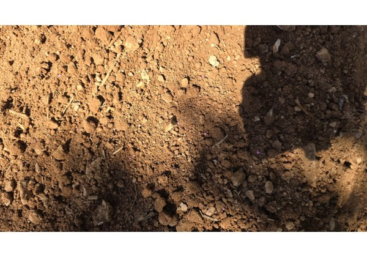](assets/images/KakaoTalk_Photo_2026-09-05-23-00-39 016.jpeg)

노출 토양 근접 사진. 촬영자 그림자와 함께 토양 상태 기록.

### 사진 017

[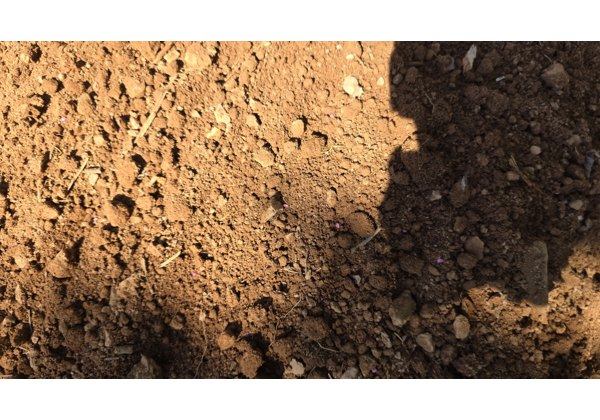](assets/images/KakaoTalk_Photo_2026-09-05-23-00-43 017.jpeg)

노출 토양 근접 사진. 파종부 토양 표면의 연속 기록.

### 사진 018

[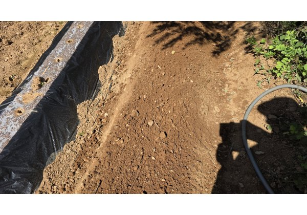](assets/images/KakaoTalk_Photo_2026-09-05-23-00-47 018.jpeg)

멀칭 두둑 옆 노출된 좁은 작업면/파종 구간을 길게 촬영한 기록.

### 사진 019

[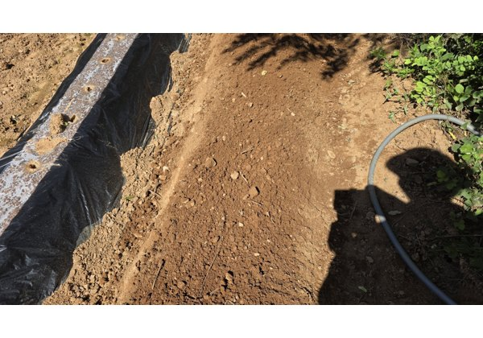](assets/images/KakaoTalk_Photo_2026-09-05-23-00-51 019.jpeg)

멀칭 두둑 가장자리의 노출 토양 구간. 호스와 주변 작물·식생 일부 확인.

### 사진 020

[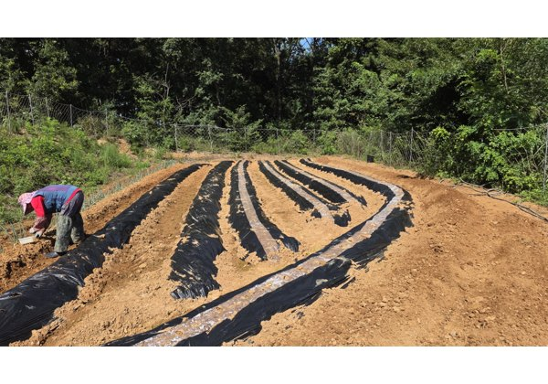](assets/images/KakaoTalk_Photo_2026-09-05-23-00-56 020.jpeg)

포장 전체 전경과 작업자가 멀칭 두둑 가장자리에서 작업하는 모습.

### 사진 021

[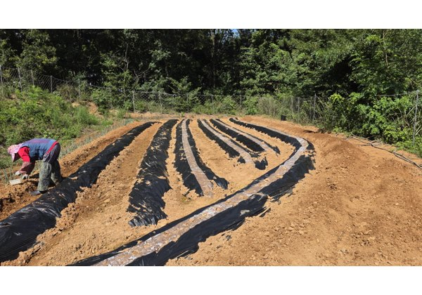](assets/images/KakaoTalk_Photo_2026-09-05-23-00-59 021.jpeg)

작업 마무리 단계의 포장 전체 전경. 두둑 배열과 작업자 위치 확인.

## 동영상 8개 상세 기록

### 동영상 1 — `KakaoTalk_Video_2026-09-05-22-58-46.mp4` (4.0초)

[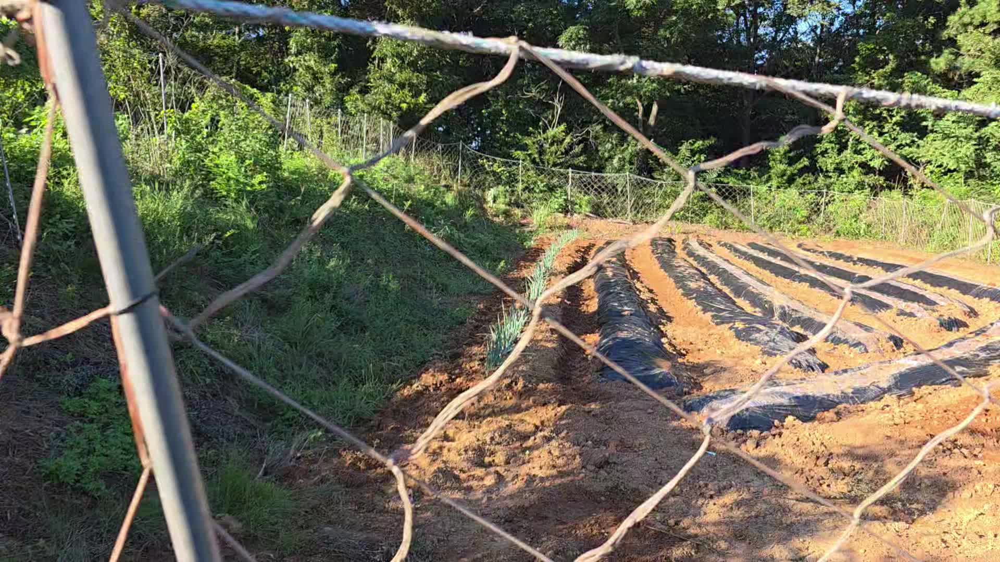](assets/videos/KakaoTalk_Video_2026-09-05-22-58-46.mp4)

울타리·가지 너머에서 포장과 두둑을 훑어보며 현장 전체 배치를 기록.

### 동영상 2 — `KakaoTalk_Video_2026-09-05-22-58-51.mp4` (7.2초)

[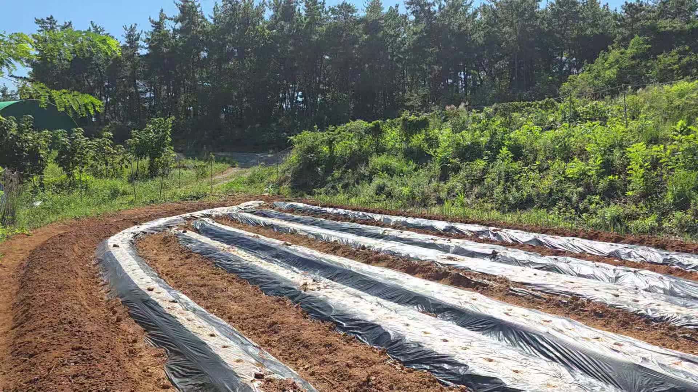](assets/videos/KakaoTalk_Video_2026-09-05-22-58-51.mp4)

멀칭 두둑 여러 줄을 따라 이동하며 포장 전경과 고랑 상태를 기록.

### 동영상 3 — `KakaoTalk_Video_2026-09-05-22-58-58.mp4` (9.9초)

[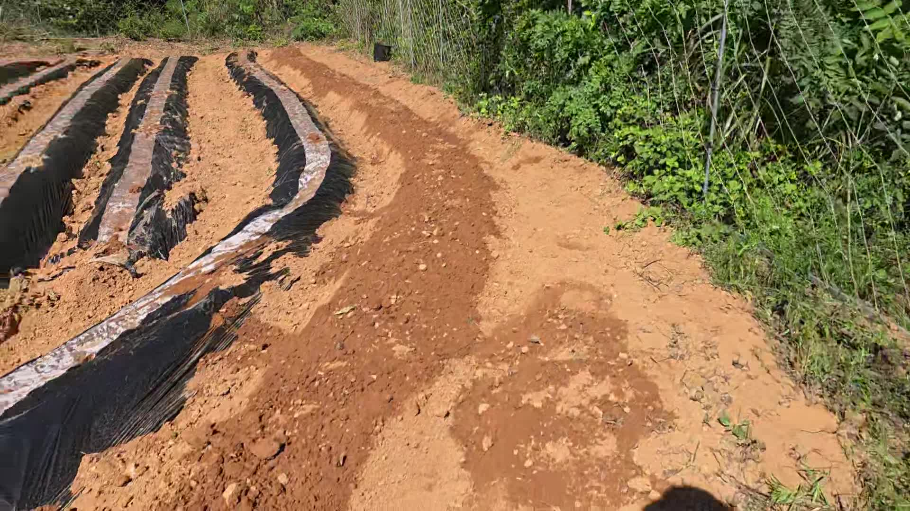](assets/videos/KakaoTalk_Video_2026-09-05-22-58-58.mp4)

멀칭 두둑 옆 바깥 작업면과 포장 외곽을 따라 촬영한 기록.

### 동영상 4 — `KakaoTalk_Video_2026-09-05-22-59-02.mp4` (3.2초)

[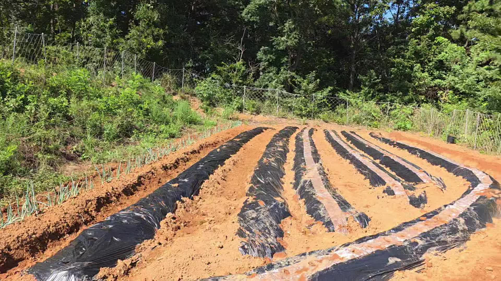](assets/videos/KakaoTalk_Video_2026-09-05-22-59-02.mp4)

포장 전체를 넓게 훑어보며 멀칭 두둑의 배치와 작업 상태를 기록.

### 동영상 5 — `KakaoTalk_Video_2026-09-05-22-59-11.mp4` (28.6초)

[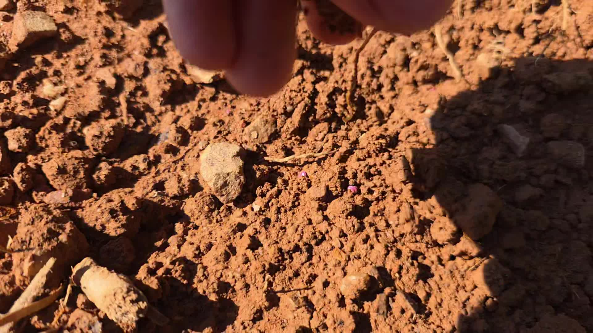](assets/videos/KakaoTalk_Video_2026-09-05-22-59-11.mp4)

토양 표면을 매우 가까이 촬영해 파종부로 보이는 흙 상태를 확인.

### 동영상 6 — `KakaoTalk_Video_2026-09-05-22-59-16.mp4` (2.3초)

[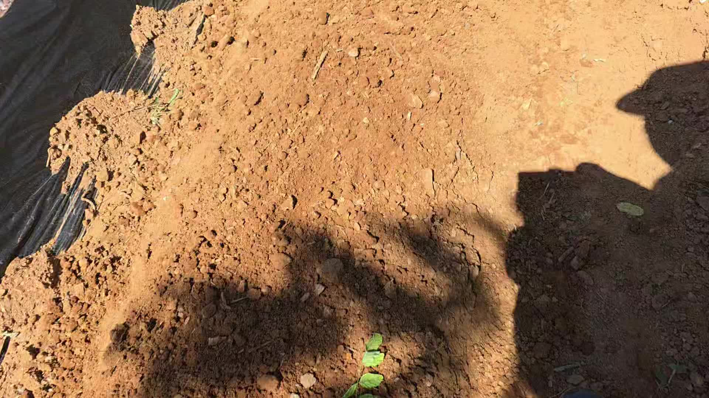](assets/videos/KakaoTalk_Video_2026-09-05-22-59-16.mp4)

멀칭 두둑 옆 노출 토양 구간을 따라 이동하며 표면 상태를 기록.

### 동영상 7 — `KakaoTalk_Video_2026-09-05-22-59-22.mp4` (6.7초)

[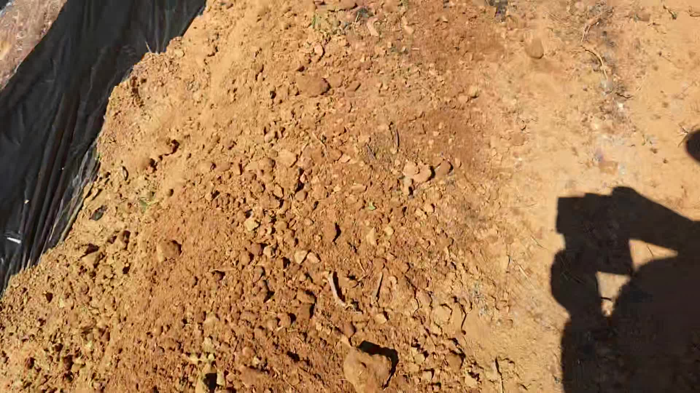](assets/videos/KakaoTalk_Video_2026-09-05-22-59-22.mp4)

노출 토양 구간을 연속 촬영하여 파종 작업 후 표면 상태를 확인.

### 동영상 8 — `KakaoTalk_Video_2026-09-05-22-59-30.mp4` (8.5초)

[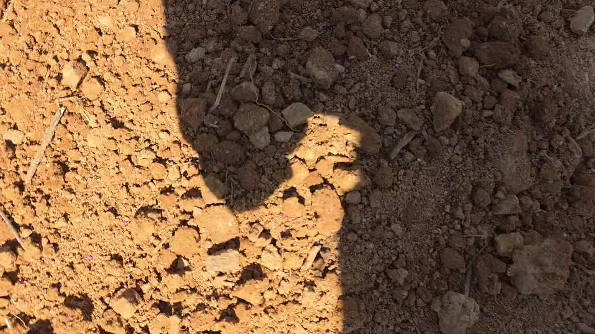](assets/videos/KakaoTalk_Video_2026-09-05-22-59-30.mp4)

토양 표면을 근접 촬영한 영상. 흙 입자와 파종부 상태를 연속적으로 기록.

## 자료에서 확인되는 작업 흐름

1. 작업자와 현장 주변 상태를 기록한다.
2. 멀칭 두둑과 고랑·외곽 작업면을 여러 방향에서 촬영한다.
3. 파종부로 보이는 노출 토양을 근접 촬영해 흙 표면 상태를 남긴다.
4. 작업 중·작업 후 포장 전체를 다시 촬영해 완료 상태를 기록한다.

## 확인되지 않는 항목

품종명, 실제 종자 사용량, 정확한 파종 간격·깊이, 열무와 무 각각의 구체적인 위치 구분은 첨부 자료만으로 확정할 수 없어 기재하지 않았다.
