# 2026년 9월 5일 화곡농장 하우스 앞밭 화이트클로버 자동급수 기록

## 1. 작업 개요

| 항목 | 내용 |
|---|---|
| 작업일 | 2026년 9월 5일 |
| 확인 촬영 | 2026년 9월 6일 08:13~08:25 및 타이머 화면 확인 |
| 장소 | 화곡농장 비닐하우스 및 하우스 앞밭 |
| 대상 | 새로 파종한 화이트클로버 구역 |
| 목적 | 발아 전 토양 표면이 마르지 않도록 자동급수 구성 |
| 주요 장비 | Ehico 자동급수 타이머, 수도 4구 분배기, 호스, 회전식 스프링클러 |

## 2. 현장 구성

- 비닐하우스 내부 수도에 4구 분배기를 설치하고 그중 한 출구에 Ehico 자동급수 타이머를 연결했다.
- 타이머 하단에 급수 호스를 연결해 하우스 밖 화이트클로버 파종 구역으로 배치했다.
- 밭 중앙 부근에 회전식 스프링클러를 설치하고, 벽돌과 돌로 받쳐 자세를 고정했다.
- 현장에는 전기 릴선과 가습·급수 관련 설비가 함께 놓여 있었으며, 파종에 사용한 화이트클로버 종자도 확인됐다.

## 3. 타이머 설정값

| 설정 항목 | 확인값 | 의미 |
|---|---:|---|
| 1회 급수시간 | 1분 | 작동할 때마다 1분간 물 공급 |
| 급수간격 | 2시간 | 기준 시작 후 2시간마다 반복 |
| 기준 시작시각 | 22:41 | 첫 작동 기준 시각 |
| 화면 확인시각 | 23:20 | 설정을 확인한 현재 시각 |
| 화면 표시 | `NEXT START 23 HRS` | 당일 22:41이 이미 지나 다음 날 22:41까지 대기 중이라는 뜻 |

따라서 화면 확인 당시에는 곧바로 2시간 뒤에 작동하는 상태가 아니라, **다음 날 22:41에 처음 작동한 후 2시간 간격으로 반복**될 것으로 해석된다.

## 4. 즉시 작동 확인 방법

설치 당일 바로 물이 나오는지 시험하려면 시작시각을 현재시각보다 2~3분 뒤로 설정한다. 첫 급수가 정상적으로 끝난 것을 확인한 뒤 원하는 기준 시작시각으로 다시 맞춘다.

## 5. 파종 직후 관리 메모

- 화이트클로버 발아 전에는 씨앗이 놓인 얕은 표토가 완전히 마르지 않게 유지하는 것이 중요하다.
- `2시간마다 1분`은 급수량 자체보다 스프링클러의 분사 범위, 수압, 토질, 햇볕과 바람에 따라 결과가 달라진다.
- 물이 고이거나 씨앗과 흙이 흘러내리면 1회 시간을 줄이거나 간격을 늘린다.
- 표면이 계속 말라 밝게 변하면 1회 시간을 조금 늘리거나 낮 시간대 간격을 조정한다.
- 발아가 고르게 진행되고 뿌리가 자리 잡으면 과습을 피하도록 급수 횟수를 단계적으로 줄인다.

## 6. 사진 기록

### 자동급수 장치와 하우스 내부

| 수도·타이머 연결 | 타이머 화면 | 하우스 내부 배관 |
|---|---|---|
| 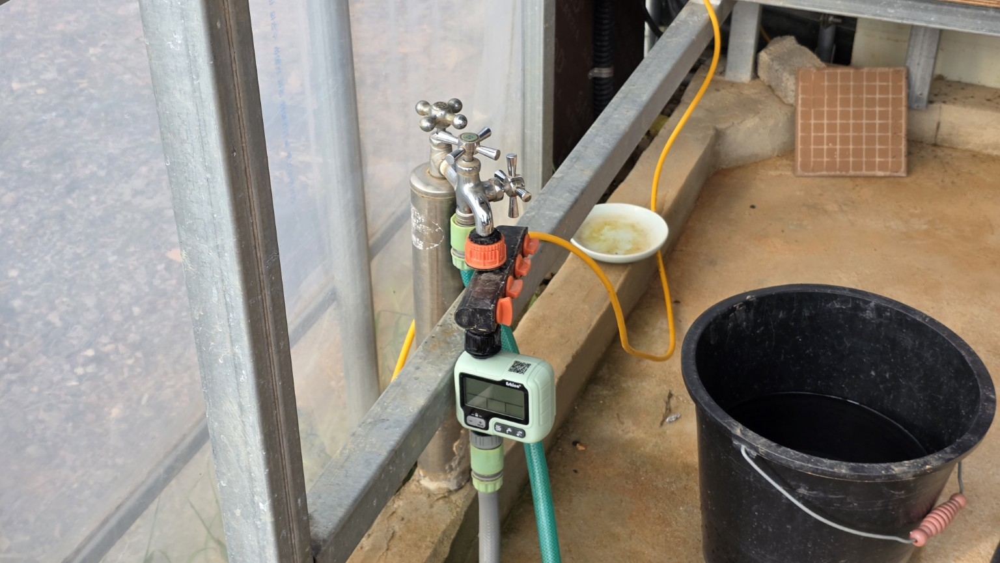 | 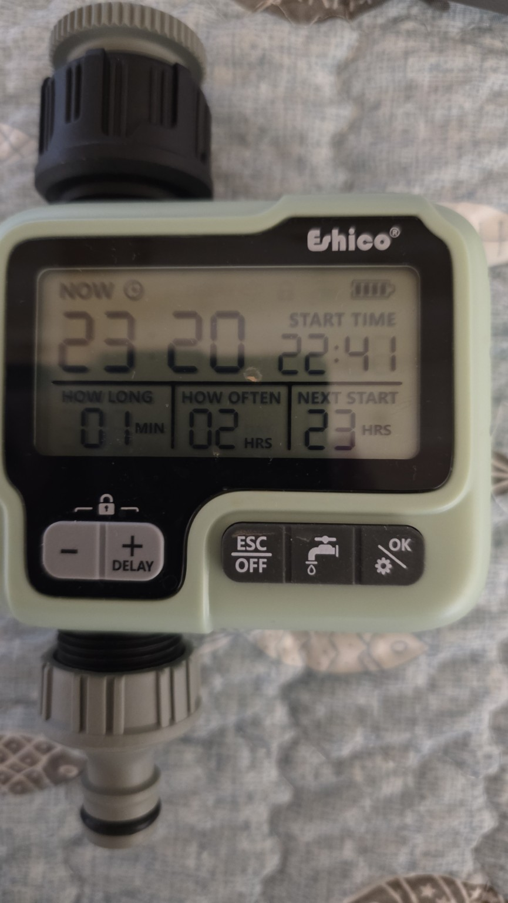 | 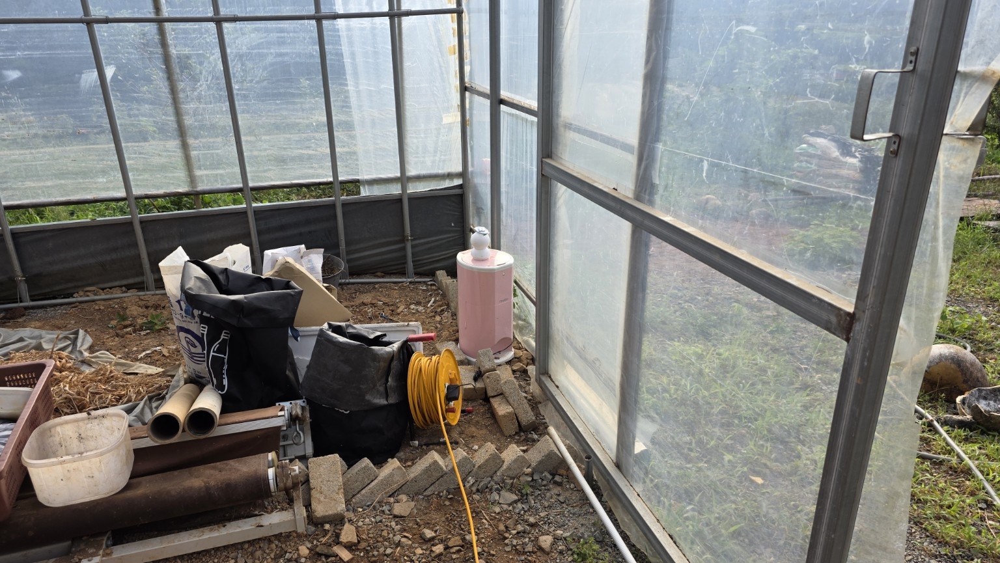 |

| 분배기 근접 | 급수 설비 | 하우스 출입구 |
|---|---|---|
| 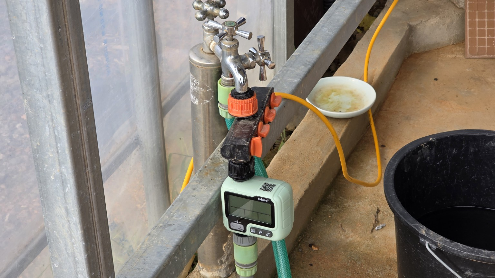 | 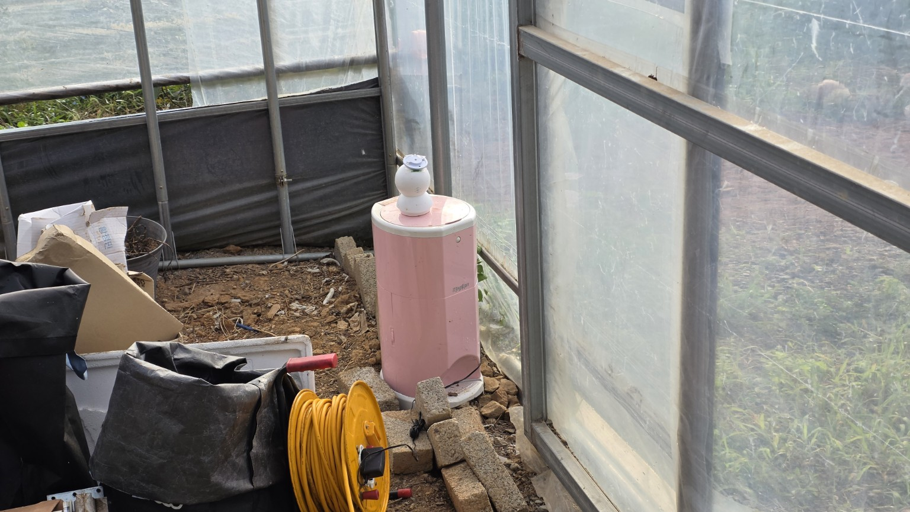 | 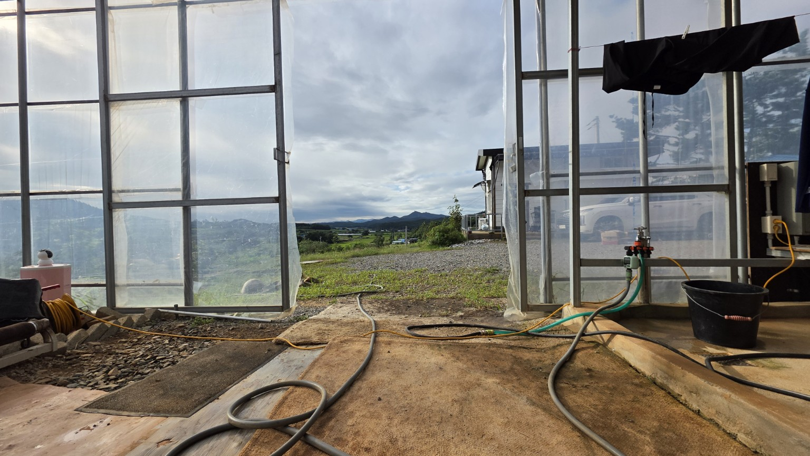 |

### 파종 구역과 스프링클러

| 스프링클러 배치 | 파종 구역 전경 | 토양 표면 |
|---|---|---|
| 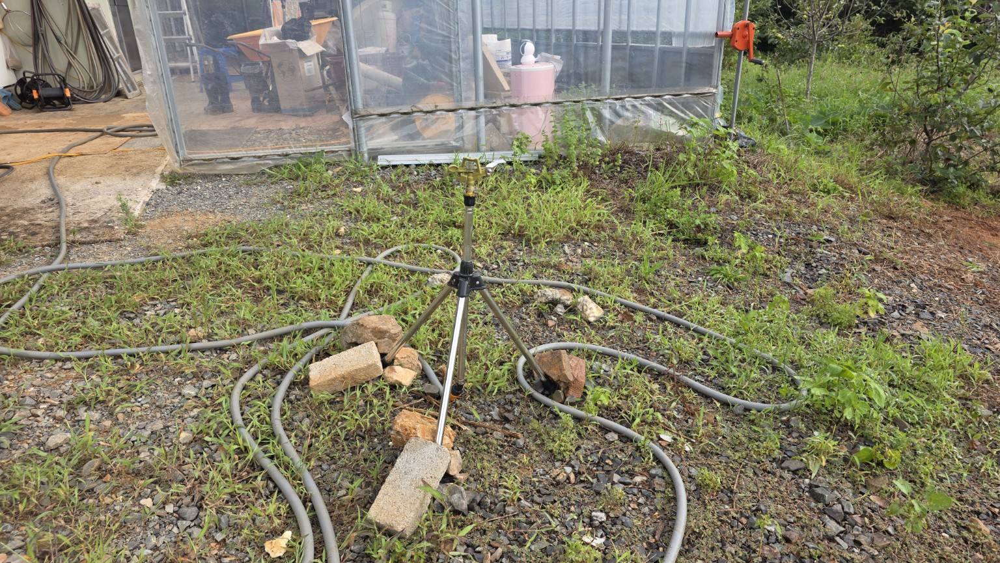 | 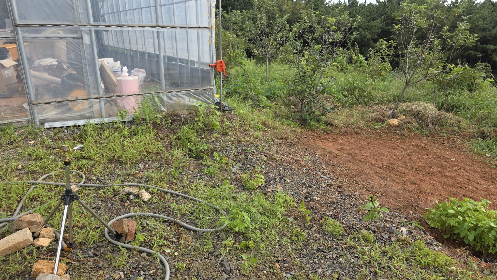 | 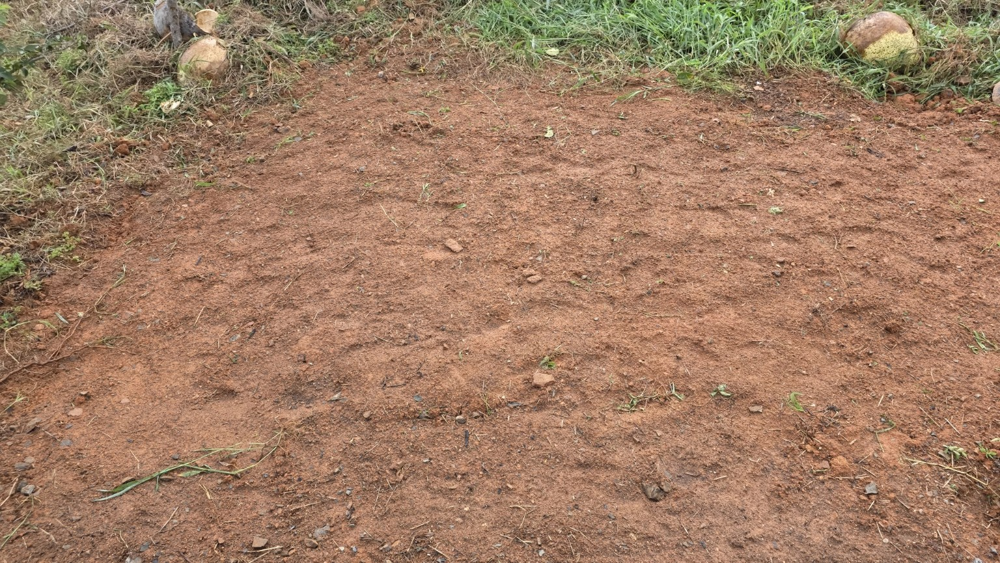 |

| 파종 구역 근접 | 출입구와 호스 | 종자 상태 |
|---|---|---|
| 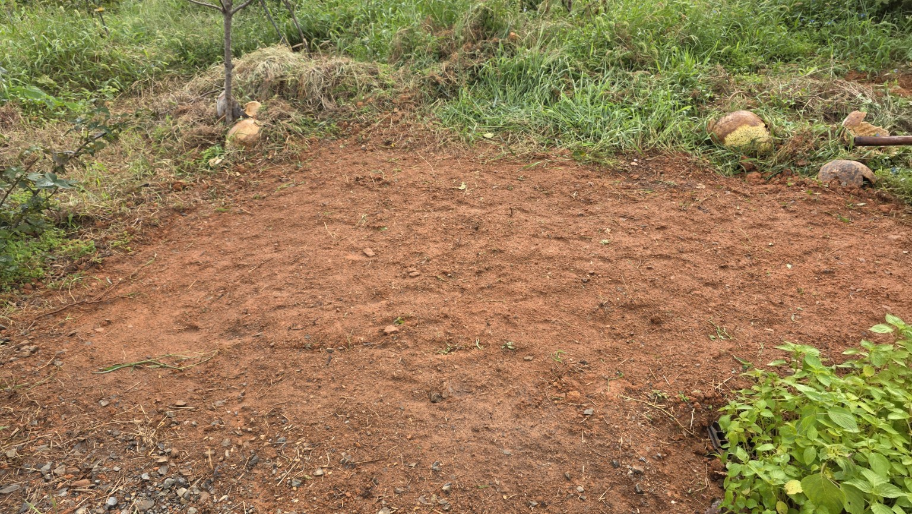 | 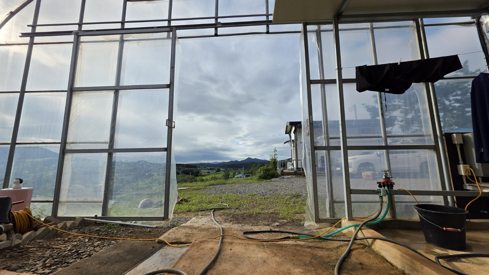 | 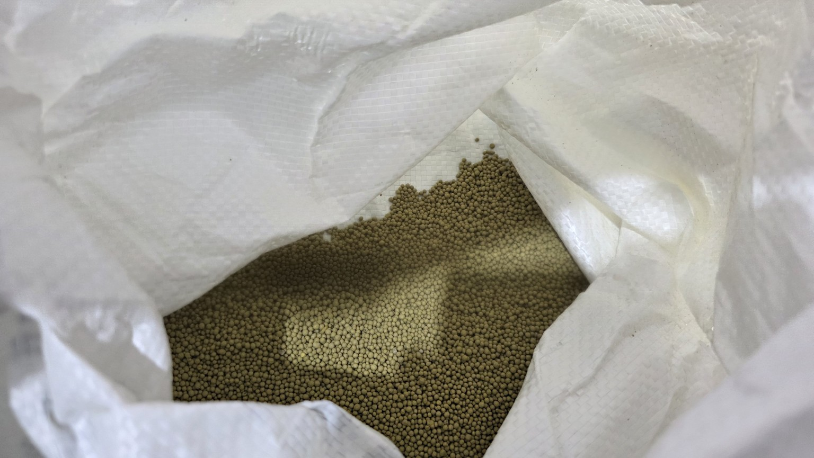 |

## 7. 영상 기록

- `1000064646.mp4`
- `1000064647.mp4`
- `20260906_081352.mp4`
- `20260906_082501.mp4`
- `20260906_082539.mp4`

---

이 문서는 현장 사진과 영상, 타이머 화면에 표시된 설정값을 근거로 작성한 작업 기록이다.
