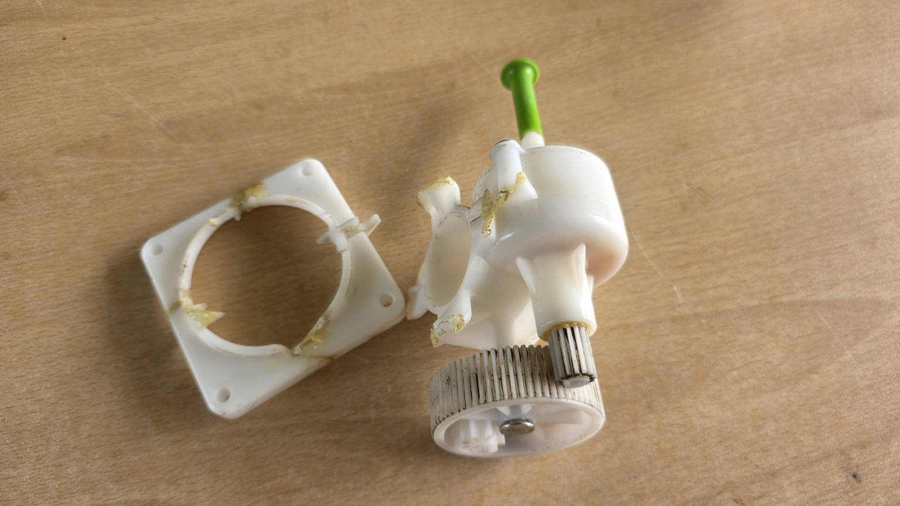
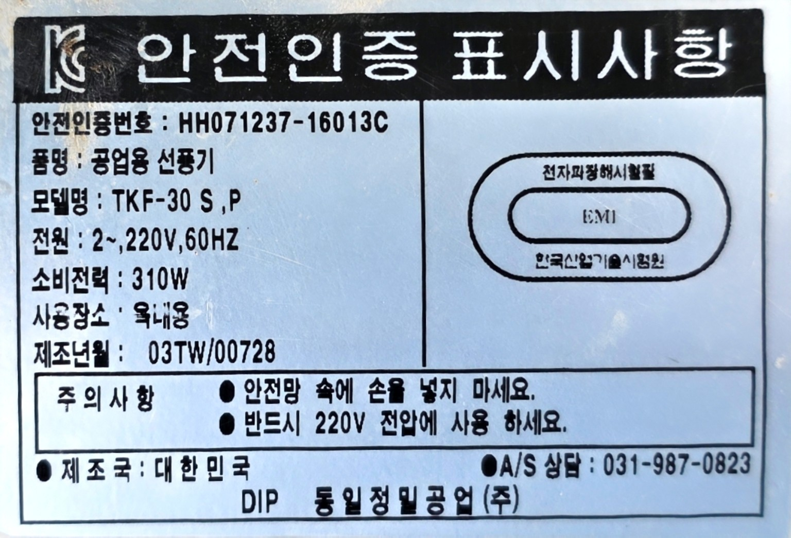
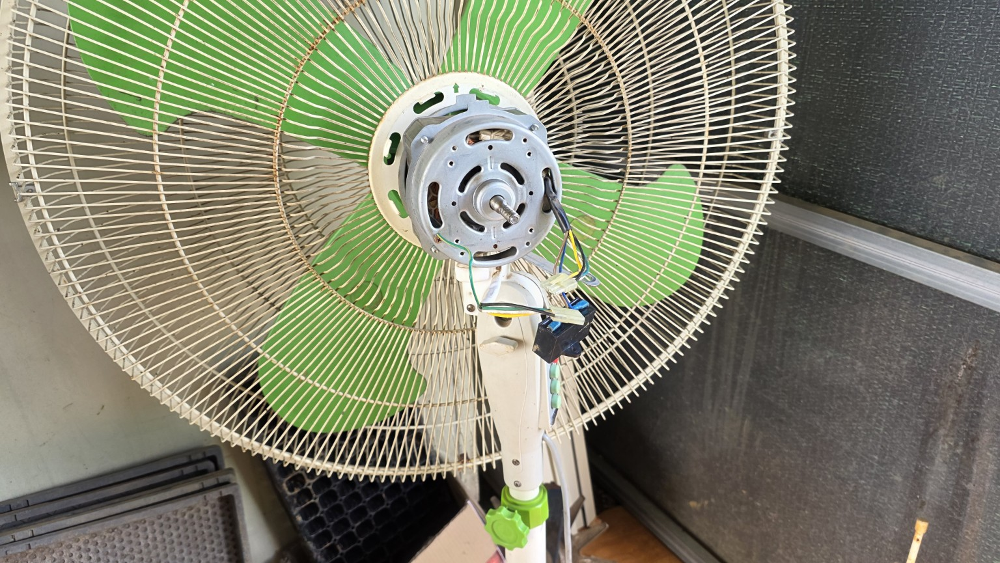
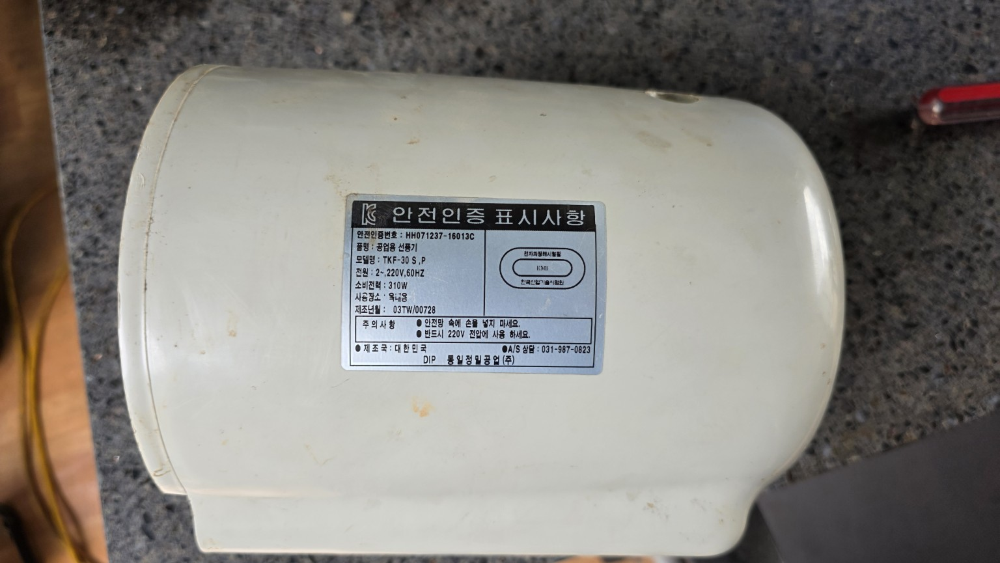
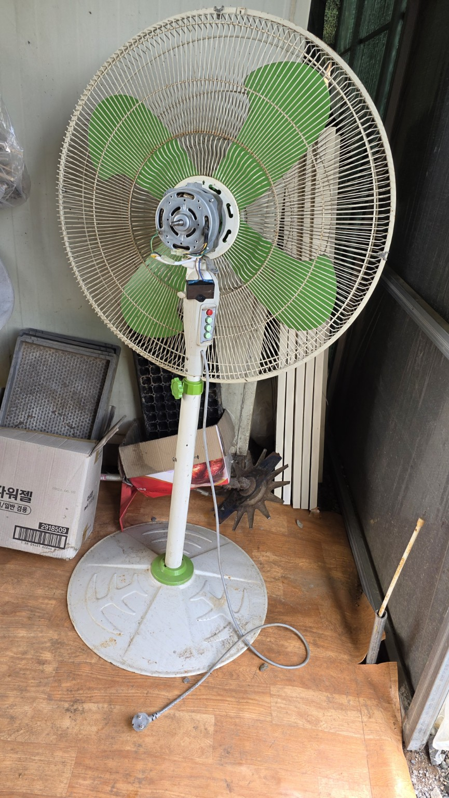
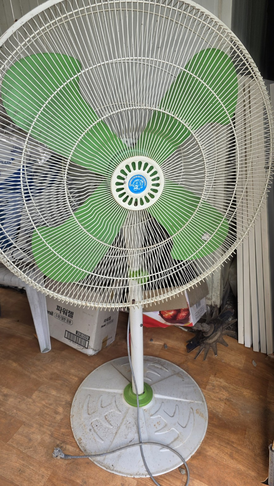
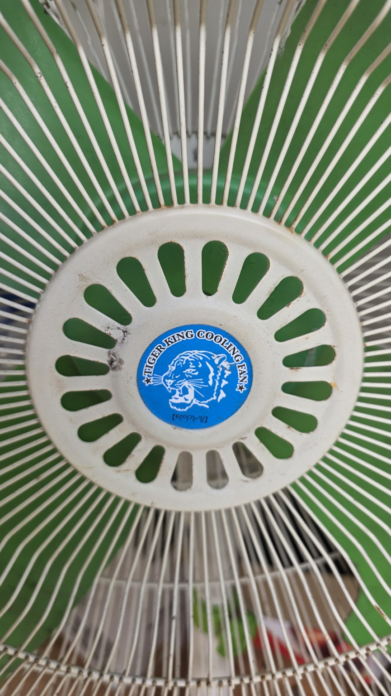
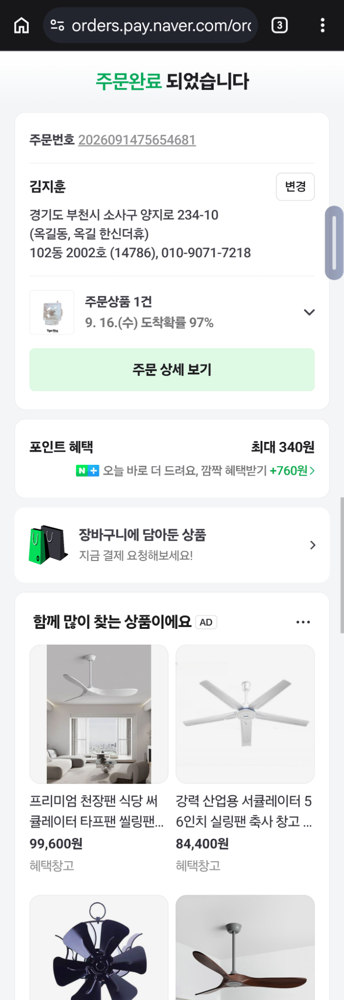
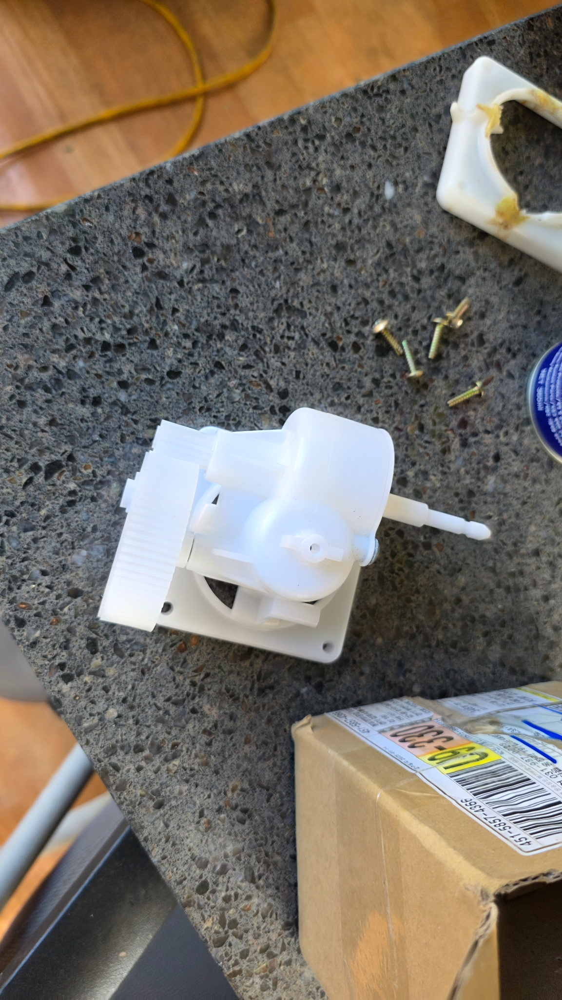

# 타이거킹 공업용 선풍기 회전기어박스 수리 기록

> 기록일: 2026-09-14  
> 대상: 동일정밀공업 타이거킹(Tiger King) 공업용 선풍기  
> 주의: 이 문서에 포함된 주문 화면에는 개인정보가 표시되어 있으므로 공개 배포 전에 반드시 가림 처리해야 합니다.

## 1. 기기 정보

| 항목 | 확인 내용 |
|---|---|
| 모델 | TKF-30 S,P |
| 규격 | 30인치 공업용 선풍기 |
| 정격 | 단상 220V, 60Hz, 310W |
| 제조 시기 | 2003년 7월 |
| 제조사/브랜드 | 동일정밀공업㈜ / Tiger King |

## 2. 고장 진단

사진상 좌우 회전(회전운전)을 담당하는 흰색 플라스틱 기어박스의 하우징과 고정 날개가 여러 곳 파손되었습니다. 접착제로 보수했던 흔적도 있으나 다시 깨졌으며, 내부 기어와 축이 남아 있어도 하우징을 단단히 고정할 수 없어 정상적인 좌우 회전은 어렵습니다.

순간접착제만으로 재접착하면 회전 부하와 진동 때문에 다시 파손될 가능성이 높습니다. 기어박스가 흔들리는 상태로 전원을 켜면 회전축이나 배선에 걸릴 수 있으므로 그대로 운전하지 않는 것이 안전합니다.

## 3. 권장 수리 방법

가장 좋은 방법은 **회전기어박스 전체 교체**입니다.

| 우선순위 | 방법 | 판단 |
|---|---|---|
| 1 | 동일 규격 회전기어박스 전체 교체 | 권장 |
| 2 | 금속 브래킷과 볼트로 파손부 보강 | 부품을 구하지 못할 때 임시 대안 |
| 3 | 회전기어를 분리하고 고정형으로 사용 | 좌우 회전이 필요 없을 때 대안 |
| 제외 | 순간접착제만으로 재접착 | 진동·부하로 재파손 가능성이 높음 |

판매자에게는 다음과 같이 문의하면 됩니다.

> 동일정밀공업 타이거킹 공업용 선풍기 TKF-30S/P, 30인치, 310W용 좌우 회전기어박스(회전박스·오실레이션 기어박스) 호환 여부를 확인해 주세요.

## 4. 주문 기록

- 판매 페이지: [네이버 스마트스토어 상품 보기](https://smartstore.naver.com/dip-store/products/4988628095)
- 주문일: 2026-09-14
- 주문 수량: 1개
- 주문금액: 20,000원
- 주문 화면상 도착 예정: 2026-09-16, 도착확률 97%
- 주문번호·주소·전화번호는 개인정보 보호를 위해 본문에 옮기지 않았습니다.

> **중요:** 주문한 부품이 실제로 TKF-30 S,P에 맞는지는 수령 후 기존 부품과 대조하기 전까지 확정할 수 없습니다.

## 5. 수령 후 호환성 확인표

| 확인 항목 | 확인 방법 | 합격 기준 |
|---|---|---|
| 고정 구멍 간격 | 기존품과 나란히 놓고 중심 간 거리 측정 | 위치와 간격이 동일 |
| 모터축 맞물림 | 웜기어/구동축 위치 비교 | 억지 없이 정확히 맞물림 |
| 출력축 | 길이와 굵기 비교 | 링크 또는 회전축과 동일 규격 |
| 연결봉 방향 | 좌우 회전 링크 방향 비교 | 기존 구조와 같은 방향 |
| 하우징 간섭 | 모터 커버 안에서 위치 확인 | 배선·커버와 닿지 않음 |
| 손회전 상태 | 전원을 넣지 않고 축을 천천히 돌림 | 걸림·비정상 유격 없음 |

## 6. 교체 작업 순서

1. 플러그를 뽑고 전원이 완전히 분리됐는지 확인합니다.
2. 기존 기어박스와 새 부품의 크기, 고정 구멍, 입력축, 출력축, 연결봉 방향을 비교합니다.
3. 새 기어박스를 흔들림 없이 단단히 고정합니다.
4. 전원을 넣기 전에 날개와 회전축을 손으로 천천히 돌려 걸림이 없는지 확인합니다.
5. 보호망과 커버를 모두 조립한 뒤 낮은 풍속에서 짧게 시험합니다.
6. 소음, 심한 저항, 유격, 배선 접촉이 있으면 즉시 전원을 끕니다.

## 7. 현장 사진

### 파손 부품 및 모터부

### 선풍기 전체 및 전면부

### 주문 완료 화면

> 아래 이미지는 이름, 주소, 전화번호 및 주문번호가 포함된 원본입니다. 외부 공유 전 반드시 가림 처리하세요.

### 수령한 교체용 회전기어박스

사진상 새 흰색 플라스틱 회전기어박스 본체, 대형 기어, 출력축 및 고정 베이스가 확인됩니다. 실제 장착 전에는 기존 부품과 고정 구멍 간격 및 축 규격을 반드시 대조해야 합니다.

## 8. 안전 메모

- 기어박스가 덜렁거리거나 배선에 닿는 상태에서는 전원을 켜지 마세요.
- 전기 작업에 익숙하지 않으면 선풍기 수리점 또는 전동기 수리점에 교체를 맡기세요.
- 날개를 손으로 돌렸을 때 뻑뻑하거나 긁히는 느낌이 있으면 주 모터와 베어링도 함께 점검하세요.
