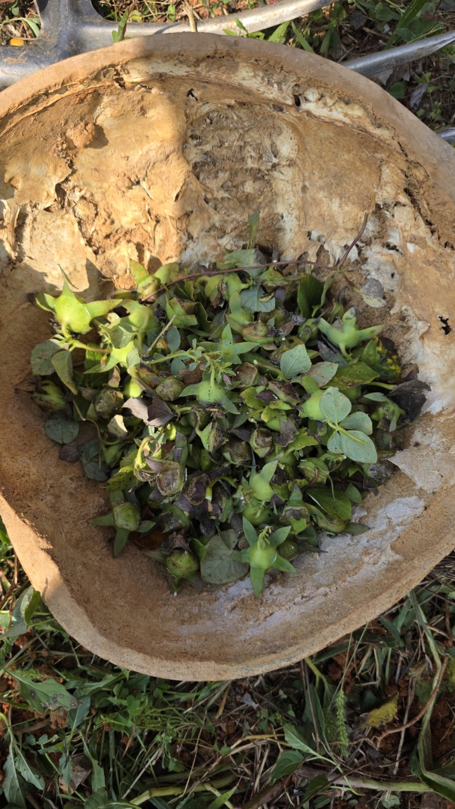
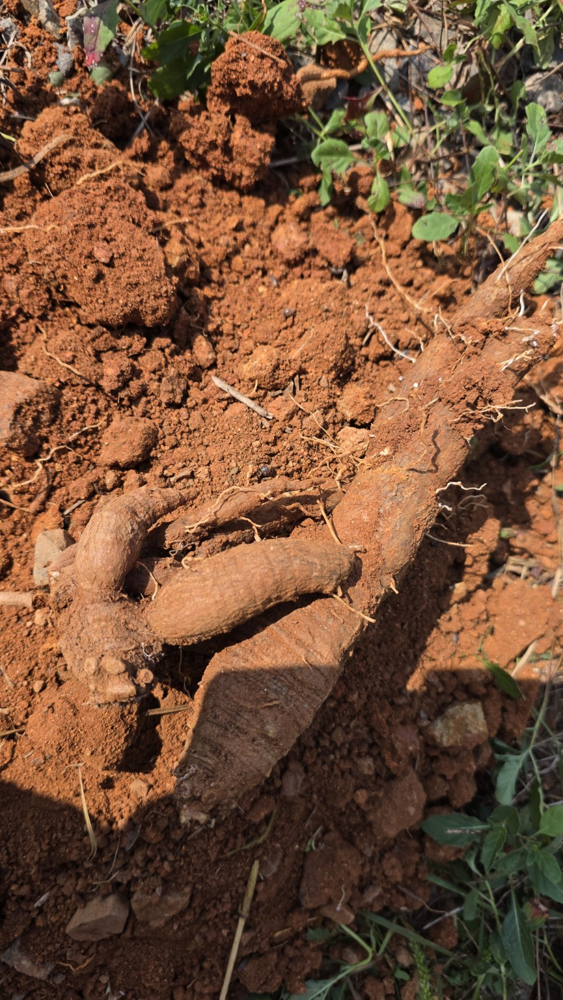
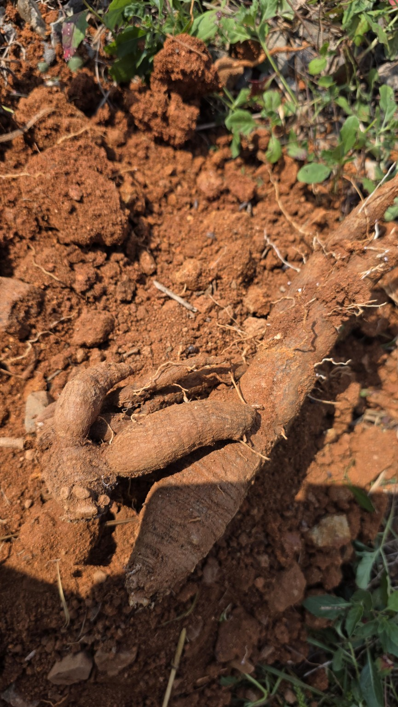
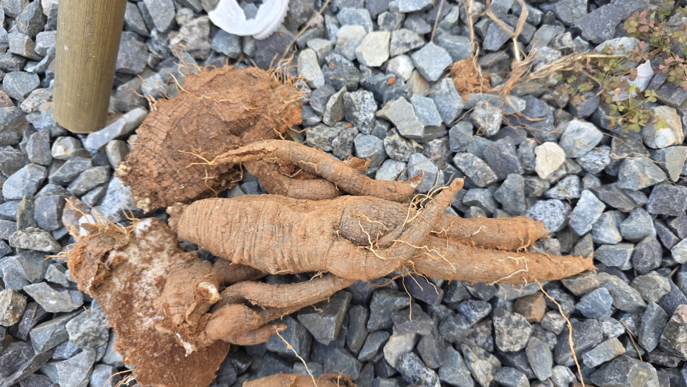
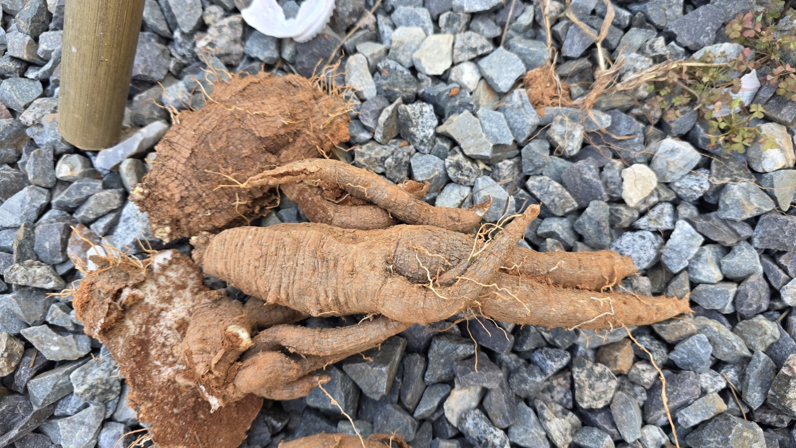

# 화곡농장 더덕수확과 씨앗채취

**작업일 2026-09-23 · 화곡농장**

사용자가 붙인 원래 제목은 **“20260923 화곡농장 더덕수확 &더덕씨”**입니다. 이 문서는 해당 사진·영상의 실제 내용과 대화에서 확인되는 기록을 새로 정리한 보관본입니다. 새로운 재배 지침이나 수확량 추정은 덧붙이지 않았습니다.

| 항목 | 확인 내용 |
|---|---|
| 작업명 | 더덕 수확 및 더덕씨 관련 채취 기록 |
| 작업일·장소 | 2026년 9월 23일 · 화곡농장 — 사용자 제공 |
| 농작업 사진 | JPG 원본 **7장** |
| 농작업 영상 | MP4 원본 **3개**, 웹 재생용 사본 **3개** |
| 기타 화면·이미지 | 대화 첨부 화면 **2장**, 기존 검증 캡처 **10장**, 영상 대표 화면 **3장** |
| 시간 표기의 근거 | 원본 파일명 12:47:11~13:54:45; 작업 소요시간·시작·종료 시각은 미확인 |
| 정리본 작성일 | 2026-10-05; 작업일과 별개 |

[작업 기록](#work-record) · [사진·영상 목록](#media-list) · [대화·배포 수정 경과](history.html) · [모든 화면 캡처](history.html#screenshots) · [첨부 원본 목록](source-inventory.json)

<h2 id="work-record">1. 더덕씨 관련 채취 기록과 뿌리 수확 과정</h2>

### 1-1. 채취한 열매(삭과)를 모아 둔 모습

12:47:11 파일은 용기에 잎·줄기와 함께 모아 둔 열매를 보여 줍니다. 녹색과 갈색 부분이 함께 보입니다. 사용자 작업명은 “더덕씨”이지만, **사진에서 직접 확인되는 것은 삭과를 모아 둔 상태**입니다. 분리된 씨앗, 채종 완료, 발아 여부까지 확인한 자료는 아닙니다.

### 사진 12:47:11 · 채취한 더덕 삭과

용기에 모아 둔 잎·줄기와 녹색 및 갈색 삭과가 보입니다. 분리한 씨앗 자체를 촬영한 사진은 아닙니다.  
**원본:** [20260923_124711.jpg](images/20260923_124711.jpg) · 865 × 1536px

### 1-2. 붉은 흙 속에서 드러난 뿌리

12시대 사진·영상에 이미 뿌리를 드러낸 현장이 나타납니다. 주변 식생, 파낸 흙, 굵고 여러 갈래로 나뉜 뿌리가 보입니다. 따라서 “12시에는 씨앗만 채취하고 13시부터 굴취를 시작했다”는 순서는 이 자료만으로 확정하지 않습니다.

### 영상 12:47:13 · 주변 식생에서 굴취 자리로

<figure class="video-card"><video controls playsinline preload="metadata" poster="posters/20260923_124713.jpg" aria-label="주변 식생에서 굴취 자리로"><source src="playback/20260923_124713_h264.mp4" type="video/mp4"></video><figcaption>주변 잎과 줄기를 비춘 뒤 흙을 파낸 자리와 노출된 뿌리 쪽으로 화면이 이동합니다.</figcaption></figure>

[영상 대표 화면](posters/20260923_124713.jpg) · [원본 MP4](videos/20260923_124713.mp4) · [웹 재생용 MP4](playback/20260923_124713_h264.mp4)  
**원본 길이:** 약 3.12초. 원본의 소리도 보존하며, 자동 재생하지 않습니다.

### 영상 12:47:25 · 드러난 뿌리의 현장 영상

<figure class="video-card"><video controls playsinline preload="metadata" poster="posters/20260923_124725.jpg" aria-label="드러난 뿌리의 현장 영상"><source src="playback/20260923_124725_h264.mp4" type="video/mp4"></video><figcaption>흙 속에서 드러난 굵은 뿌리와 여러 갈래로 분지한 부분을 가까이 기록했습니다.</figcaption></figure>

[영상 대표 화면](posters/20260923_124725.jpg) · [원본 MP4](videos/20260923_124725.mp4) · [웹 재생용 MP4](playback/20260923_124725_h264.mp4)  
**원본 길이:** 약 1.92초. 원본의 소리도 보존하며, 자동 재생하지 않습니다.

### 사진 12:47:28 · 흙에서 드러난 더덕 뿌리

붉은 흙을 걷어 낸 자리에서 굵고 갈라진 뿌리가 드러나 있습니다.  
**원본:** [20260923_124728.jpg](images/20260923_124728.jpg) · 865 × 1536px

### 사진 12:47:29 · 굴취 현장 가까이 보기

앞 사진과 같은 굴취 현장을 가까운 각도에서 기록했습니다. 뿌리와 주변 흙 상태를 볼 수 있습니다.  
**원본:** [20260923_124729.jpg](images/20260923_124729.jpg) · 865 × 1536px

### 1-3. 자갈 위에 놓인 수확물 전체와 근접 모습

13:54:37 이후의 파일은 자갈 바닥 위에 놓은 수확물의 전체 모습과 굵은 부분·분지 형태를 기록합니다. 흙이 묻은 표면과 잔뿌리를 확인할 수 있습니다. 사진에 함께 나온 물건을 길이 기준으로 사용하거나, 모습만으로 연근·중량·상품성을 추정하지 않았습니다.

### 사진 13:54:37 · 수확한 더덕 전체 모습

자갈 바닥 위에 놓은 수확물의 전체 배치와 여러 갈래로 나뉜 뿌리 형태를 기록했습니다.  
**원본:** [20260923_135437.jpg](images/20260923_135437.jpg) · 1536 × 865px

### 영상 13:54:39 · 수확물의 전체와 근접 모습

<figure class="video-card"><video controls playsinline preload="metadata" poster="posters/20260923_135439.jpg" aria-label="수확물의 전체와 근접 모습"><source src="playback/20260923_135439_h264.mp4" type="video/mp4"></video><figcaption>자갈 바닥에 놓인 수확물 전체에서 뿌리의 굵기와 갈라진 부분 쪽으로 화면이 이동합니다.</figcaption></figure>

[영상 대표 화면](posters/20260923_135439.jpg) · [원본 MP4](videos/20260923_135439.mp4) · [웹 재생용 MP4](playback/20260923_135439_h264.mp4)  
**원본 길이:** 약 1.30초. 원본의 소리도 보존하며, 자동 재생하지 않습니다.

### 사진 13:54:41 · 길게 뻗은 뿌리와 분지

길쭉한 뿌리, 갈라진 부분, 잔뿌리와 흙이 묻은 표면을 가까이 기록했습니다.  
**원본:** [20260923_135441.jpg](images/20260923_135441.jpg) · 1536 × 865px

### 사진 13:54:42 · 같은 수확물의 다른 사진

앞 사진과 비슷한 구도지만 별개의 원본입니다. 임의로 중복 삭제하지 않고 보존했습니다.  
**원본:** [20260923_135442.jpg](images/20260923_135442.jpg) · 1536 × 865px

### 사진 13:54:45 · 굵은 분지부 근접 기록

넓고 굵은 부분과 옆으로 뻗은 뿌리, 표면의 흙·주름·틈을 가까이 보여 줍니다.  
**원본:** [20260923_135445.jpg](images/20260923_135445.jpg) · 1536 × 865px

<h2 id="media-list">2. 촬영 자료 10개 전체 목록</h2>

**아래 시간은 파일명 기준입니다.** 사진이 비슷해도 별개의 원본을 삭제하지 않았습니다. 각 원본은 이름·파일 내용·해시를 그대로 보존했습니다.

| 시각 | 유형 | 원본 파일 | 보이는 내용 | 원본 크기 |
|---|---|---|---|---|
| 12:47:11 | 사진 | [20260923_124711.jpg](images/20260923_124711.jpg) | 채취한 더덕 삭과 | 0.43 MB |
| 12:47:13 | 영상 | [20260923_124713.mp4](videos/20260923_124713.mp4) | 주변 식생에서 굴취 자리로 | 4.29 MB |
| 12:47:25 | 영상 | [20260923_124725.mp4](videos/20260923_124725.mp4) | 드러난 뿌리의 현장 영상 | 2.39 MB |
| 12:47:28 | 사진 | [20260923_124728.jpg](images/20260923_124728.jpg) | 흙에서 드러난 더덕 뿌리 | 0.49 MB |
| 12:47:29 | 사진 | [20260923_124729.jpg](images/20260923_124729.jpg) | 굴취 현장 가까이 보기 | 0.41 MB |
| 13:54:37 | 사진 | [20260923_135437.jpg](images/20260923_135437.jpg) | 수확한 더덕 전체 모습 | 0.67 MB |
| 13:54:39 | 영상 | [20260923_135439.mp4](videos/20260923_135439.mp4) | 수확물의 전체와 근접 모습 | 1.75 MB |
| 13:54:41 | 사진 | [20260923_135441.jpg](images/20260923_135441.jpg) | 길게 뻗은 뿌리와 분지 | 0.46 MB |
| 13:54:42 | 사진 | [20260923_135442.jpg](images/20260923_135442.jpg) | 같은 수확물의 다른 사진 | 0.50 MB |
| 13:54:45 | 사진 | [20260923_135445.jpg](images/20260923_135445.jpg) | 굵은 분지부 근접 기록 | 0.40 MB |

## 3. 확인된 사실과 미확인 사항

| 항목 | 기록 범위 |
|---|---|
| 수확·채취 장소와 작업일 | 사용자 설명으로 확인 |
| 삭과, 뿌리 노출 현장, 수확물 모습 | 원본 사진과 영상으로 확인 |
| 수확 중량·정확한 수량 | 계측 자료 없음 |
| 재배 연수·실측 길이·직경 | 확인 자료 없음 |
| 정확한 작업 필지 | 이 기록에서 지정되지 않음 |
| 종자 분리·건조 완료 | 확인 자료 없음 |
| 종자 성숙도·발아율 | 이 사진·짧은 영상으로 판단하지 않음 |
| 병해·부패 여부 | 사진만으로 진단하지 않음 |

## 4. 앞선 설명에서 정정한 부분

| 이전 설명 | 원본 대조 후 기록 |
|---|---|
| 12:47:28·29는 “삭과 근접 사진” | 두 파일은 **흙에서 드러난 뿌리 사진** |
| 12:47:25 영상은 씨앗 채취 과정 | **노출된 뿌리 현장 영상** |
| 12시대 씨앗 채취 → 13시대 굴취 시작 | 12시대에도 굴취 현장이 있으므로 시작 순서를 단정하지 않음 |
| 사진·영상 파일명 목록만 있으면 미디어 포함 | 실제 파일 보존과 문서의 표시·재생·원본 다운로드를 각각 확인해야 함 |
| 사이트의 9월 24일 제목이 작업일 | 기존 제목 메타데이터의 작성일 9월 24일과 실제 작업일 **9월 23일**을 구분 |

앞서 만든 상세 MD·HTML 및 ZIP은 원본 확인용으로 그대로 보존했습니다. 그 안의 채종·건조·보관 설명이나 당시의 미완료 상태는 **과거 문서 내용**이며, 이번 수확 기록의 새로운 현장 사실로 옮기지 않았습니다.

## 5. 전체 이미지·첨부 보존 범위

| 포함 구분 | 개수 | 열기 |
|---|---:|---|
| 현장 사진 원본 | 7 | 본문 및 `images/` |
| 대화에 첨부된 오류·저장소 화면 | 2 | [화면 캡처 부록](history.html#screenshots) |
| 기존 ZIP 안의 배포 검증 캡처 | 10 | [화면 캡처 부록](history.html#screenshots) |
| 영상 대표 화면 | 3 | 각 영상 및 `posters/` |
| 원본 영상 | 3 | `videos/` |
| 웹 재생용 영상 사본 | 3 | `playback/` |
| 기존에 전달·수집된 ZIP | 19 | [보존 첨부 목록](history.html#attachments) |

직접 열람 경로의 이미지 파일은 **22개**입니다. 그중 영상 대표 화면 3개와 화면 캡처 12개는 농작업 사진 7장과 구분했습니다. 과거 ZIP·내장 HTML 안의 중복 보존본은 별도이며, 22개에 중복 가산하지 않았습니다.

## 6. 열람 방법과 근거

ZIP을 **전체 압축 해제**한 뒤 `index.html` 또는 `record.html`을 여세요. HTML에서 사진을 누르면 확대되고, 영상에는 재생 버튼과 원본 다운로드가 있습니다. Markdown은 같은 폴더의 사진 상대 경로를 사용합니다. HTML·MD만 다른 곳으로 옮기면 상대 경로 미디어가 끊길 수 있습니다.

| 근거 | 포함 위치 |
|---|---|
| 사용자 작업명·사진 7장·영상 3개 | 본문, `images/`, `videos/` |
| 이번 파일명·크기·SHA-256 대조 | [미디어 목록](media-manifest.json), [원본 보존 목록](source-inventory.json), [파일 체크섬](checksums.sha256) |
| 과거 설명과 수정 경과 | [수정 경과 부록](history.html), [부록 Markdown](history.md) |
| 과거 온라인 검증 결과 | [보존된 더덕 운영 검증 JSON](evidence/reports/hwagok-live-title-verification/deodeok-public-verification.json), [브라우저 검증 JSON](evidence/reports/hwagok-title-media-browser-final/results.json) |

**배포 상태 주의:** 부록의 운영·제목 검증은 보존된 2026-09-30 자료에 대한 정리입니다. 이번 파일 생성이 현재 공개 사이트 재배포 또는 비공개 인증 후 재검증을 뜻하지 않습니다. 전체 ZIP에는 다른 비공개 프로젝트의 점검 메타데이터도 있으므로, 채팅 보관용으로 취급하며 그대로 공개 저장소에 올리지 않습니다.
