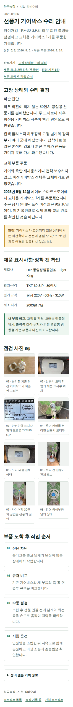
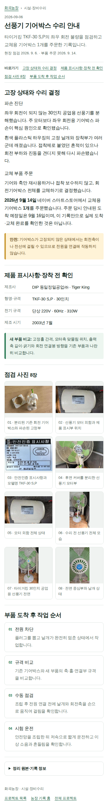
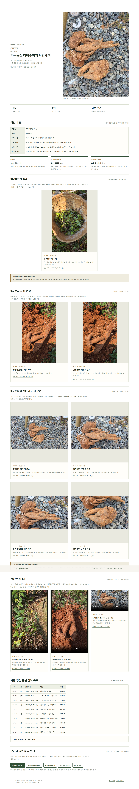
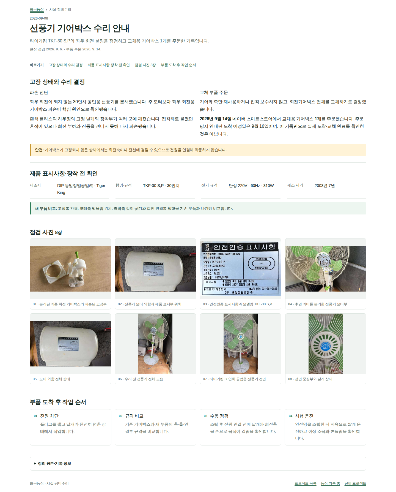
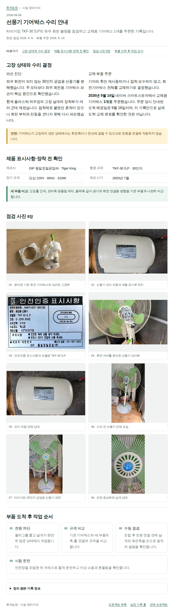
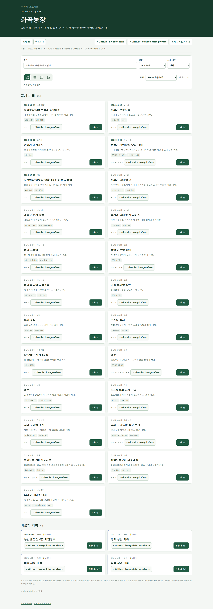

# 화곡농장 더덕수확과 씨앗채취

**작업일 2026-09-23 · 화곡농장**

사용자가 붙인 원래 제목은 **“20260923 화곡농장 더덕수확 &더덕씨”**입니다. 이 문서는 해당 사진·영상의 실제 내용과 대화에서 확인되는 기록을 새로 정리한 보관본입니다. 새로운 재배 지침이나 수확량 추정은 덧붙이지 않았습니다.

| 항목 | 확인 내용 |
|---|---|
| 작업명 | 더덕 수확 및 더덕씨 관련 채취 기록 |
| 작업일·장소 | 2026년 9월 23일 · 화곡농장 — 사용자 제공 |
| 농작업 사진 | JPG 원본 **7장** |
| 농작업 영상 | MP4 원본 **3개**, 웹 재생용 사본 **3개** |
| 기타 화면·이미지 | 대화 첨부 화면 **2장**, 기존 검증 캡처 **10장**, 영상 대표 화면 **3장** |
| 시간 표기의 근거 | 원본 파일명 12:47:11~13:54:45; 작업 소요시간·시작·종료 시각은 미확인 |
| 정리본 작성일 | 2026-10-05; 작업일과 별개 |

[작업 기록](#work-record) · [사진·영상 목록](#media-list) · [대화·배포 수정 경과](history.html) · [모든 화면 캡처](history.html#screenshots) · [첨부 원본 목록](source-inventory.json)

<h2 id="work-record">1. 더덕씨 관련 채취 기록과 뿌리 수확 과정</h2>

### 1-1. 채취한 열매(삭과)를 모아 둔 모습

12:47:11 파일은 용기에 잎·줄기와 함께 모아 둔 열매를 보여 줍니다. 녹색과 갈색 부분이 함께 보입니다. 사용자 작업명은 “더덕씨”이지만, **사진에서 직접 확인되는 것은 삭과를 모아 둔 상태**입니다. 분리된 씨앗, 채종 완료, 발아 여부까지 확인한 자료는 아닙니다.

### 사진 12:47:11 · 채취한 더덕 삭과

용기에 모아 둔 잎·줄기와 녹색 및 갈색 삭과가 보입니다. 분리한 씨앗 자체를 촬영한 사진은 아닙니다.  
**원본:** [20260923_124711.jpg](images/20260923_124711.jpg) · 865 × 1536px

### 1-2. 붉은 흙 속에서 드러난 뿌리

12시대 사진·영상에 이미 뿌리를 드러낸 현장이 나타납니다. 주변 식생, 파낸 흙, 굵고 여러 갈래로 나뉜 뿌리가 보입니다. 따라서 “12시에는 씨앗만 채취하고 13시부터 굴취를 시작했다”는 순서는 이 자료만으로 확정하지 않습니다.

### 영상 12:47:13 · 주변 식생에서 굴취 자리로

<figure class="video-card"><video controls playsinline preload="metadata" poster="posters/20260923_124713.jpg" aria-label="주변 식생에서 굴취 자리로"><source src="playback/20260923_124713_h264.mp4" type="video/mp4"></video><figcaption>주변 잎과 줄기를 비춘 뒤 흙을 파낸 자리와 노출된 뿌리 쪽으로 화면이 이동합니다.</figcaption></figure>

[영상 대표 화면](posters/20260923_124713.jpg) · [원본 MP4](videos/20260923_124713.mp4) · [웹 재생용 MP4](playback/20260923_124713_h264.mp4)  
**원본 길이:** 약 3.12초. 원본의 소리도 보존하며, 자동 재생하지 않습니다.

### 영상 12:47:25 · 드러난 뿌리의 현장 영상

<figure class="video-card"><video controls playsinline preload="metadata" poster="posters/20260923_124725.jpg" aria-label="드러난 뿌리의 현장 영상"><source src="playback/20260923_124725_h264.mp4" type="video/mp4"></video><figcaption>흙 속에서 드러난 굵은 뿌리와 여러 갈래로 분지한 부분을 가까이 기록했습니다.</figcaption></figure>

[영상 대표 화면](posters/20260923_124725.jpg) · [원본 MP4](videos/20260923_124725.mp4) · [웹 재생용 MP4](playback/20260923_124725_h264.mp4)  
**원본 길이:** 약 1.92초. 원본의 소리도 보존하며, 자동 재생하지 않습니다.

### 사진 12:47:28 · 흙에서 드러난 더덕 뿌리

붉은 흙을 걷어 낸 자리에서 굵고 갈라진 뿌리가 드러나 있습니다.  
**원본:** [20260923_124728.jpg](images/20260923_124728.jpg) · 865 × 1536px

### 사진 12:47:29 · 굴취 현장 가까이 보기

앞 사진과 같은 굴취 현장을 가까운 각도에서 기록했습니다. 뿌리와 주변 흙 상태를 볼 수 있습니다.  
**원본:** [20260923_124729.jpg](images/20260923_124729.jpg) · 865 × 1536px

### 1-3. 자갈 위에 놓인 수확물 전체와 근접 모습

13:54:37 이후의 파일은 자갈 바닥 위에 놓은 수확물의 전체 모습과 굵은 부분·분지 형태를 기록합니다. 흙이 묻은 표면과 잔뿌리를 확인할 수 있습니다. 사진에 함께 나온 물건을 길이 기준으로 사용하거나, 모습만으로 연근·중량·상품성을 추정하지 않았습니다.

### 사진 13:54:37 · 수확한 더덕 전체 모습

자갈 바닥 위에 놓은 수확물의 전체 배치와 여러 갈래로 나뉜 뿌리 형태를 기록했습니다.  
**원본:** [20260923_135437.jpg](images/20260923_135437.jpg) · 1536 × 865px

### 영상 13:54:39 · 수확물의 전체와 근접 모습

<figure class="video-card"><video controls playsinline preload="metadata" poster="posters/20260923_135439.jpg" aria-label="수확물의 전체와 근접 모습"><source src="playback/20260923_135439_h264.mp4" type="video/mp4"></video><figcaption>자갈 바닥에 놓인 수확물 전체에서 뿌리의 굵기와 갈라진 부분 쪽으로 화면이 이동합니다.</figcaption></figure>

[영상 대표 화면](posters/20260923_135439.jpg) · [원본 MP4](videos/20260923_135439.mp4) · [웹 재생용 MP4](playback/20260923_135439_h264.mp4)  
**원본 길이:** 약 1.30초. 원본의 소리도 보존하며, 자동 재생하지 않습니다.

### 사진 13:54:41 · 길게 뻗은 뿌리와 분지

길쭉한 뿌리, 갈라진 부분, 잔뿌리와 흙이 묻은 표면을 가까이 기록했습니다.  
**원본:** [20260923_135441.jpg](images/20260923_135441.jpg) · 1536 × 865px

### 사진 13:54:42 · 같은 수확물의 다른 사진

앞 사진과 비슷한 구도지만 별개의 원본입니다. 임의로 중복 삭제하지 않고 보존했습니다.  
**원본:** [20260923_135442.jpg](images/20260923_135442.jpg) · 1536 × 865px

### 사진 13:54:45 · 굵은 분지부 근접 기록

넓고 굵은 부분과 옆으로 뻗은 뿌리, 표면의 흙·주름·틈을 가까이 보여 줍니다.  
**원본:** [20260923_135445.jpg](images/20260923_135445.jpg) · 1536 × 865px

<h2 id="media-list">2. 촬영 자료 10개 전체 목록</h2>

**아래 시간은 파일명 기준입니다.** 사진이 비슷해도 별개의 원본을 삭제하지 않았습니다. 각 원본은 이름·파일 내용·해시를 그대로 보존했습니다.

| 시각 | 유형 | 원본 파일 | 보이는 내용 | 원본 크기 |
|---|---|---|---|---|
| 12:47:11 | 사진 | [20260923_124711.jpg](images/20260923_124711.jpg) | 채취한 더덕 삭과 | 0.43 MB |
| 12:47:13 | 영상 | [20260923_124713.mp4](videos/20260923_124713.mp4) | 주변 식생에서 굴취 자리로 | 4.29 MB |
| 12:47:25 | 영상 | [20260923_124725.mp4](videos/20260923_124725.mp4) | 드러난 뿌리의 현장 영상 | 2.39 MB |
| 12:47:28 | 사진 | [20260923_124728.jpg](images/20260923_124728.jpg) | 흙에서 드러난 더덕 뿌리 | 0.49 MB |
| 12:47:29 | 사진 | [20260923_124729.jpg](images/20260923_124729.jpg) | 굴취 현장 가까이 보기 | 0.41 MB |
| 13:54:37 | 사진 | [20260923_135437.jpg](images/20260923_135437.jpg) | 수확한 더덕 전체 모습 | 0.67 MB |
| 13:54:39 | 영상 | [20260923_135439.mp4](videos/20260923_135439.mp4) | 수확물의 전체와 근접 모습 | 1.75 MB |
| 13:54:41 | 사진 | [20260923_135441.jpg](images/20260923_135441.jpg) | 길게 뻗은 뿌리와 분지 | 0.46 MB |
| 13:54:42 | 사진 | [20260923_135442.jpg](images/20260923_135442.jpg) | 같은 수확물의 다른 사진 | 0.50 MB |
| 13:54:45 | 사진 | [20260923_135445.jpg](images/20260923_135445.jpg) | 굵은 분지부 근접 기록 | 0.40 MB |

## 3. 확인된 사실과 미확인 사항

| 항목 | 기록 범위 |
|---|---|
| 수확·채취 장소와 작업일 | 사용자 설명으로 확인 |
| 삭과, 뿌리 노출 현장, 수확물 모습 | 원본 사진과 영상으로 확인 |
| 수확 중량·정확한 수량 | 계측 자료 없음 |
| 재배 연수·실측 길이·직경 | 확인 자료 없음 |
| 정확한 작업 필지 | 이 기록에서 지정되지 않음 |
| 종자 분리·건조 완료 | 확인 자료 없음 |
| 종자 성숙도·발아율 | 이 사진·짧은 영상으로 판단하지 않음 |
| 병해·부패 여부 | 사진만으로 진단하지 않음 |

## 4. 앞선 설명에서 정정한 부분

| 이전 설명 | 원본 대조 후 기록 |
|---|---|
| 12:47:28·29는 “삭과 근접 사진” | 두 파일은 **흙에서 드러난 뿌리 사진** |
| 12:47:25 영상은 씨앗 채취 과정 | **노출된 뿌리 현장 영상** |
| 12시대 씨앗 채취 → 13시대 굴취 시작 | 12시대에도 굴취 현장이 있으므로 시작 순서를 단정하지 않음 |
| 사진·영상 파일명 목록만 있으면 미디어 포함 | 실제 파일 보존과 문서의 표시·재생·원본 다운로드를 각각 확인해야 함 |
| 사이트의 9월 24일 제목이 작업일 | 기존 제목 메타데이터의 작성일 9월 24일과 실제 작업일 **9월 23일**을 구분 |

앞서 만든 상세 MD·HTML 및 ZIP은 원본 확인용으로 그대로 보존했습니다. 그 안의 채종·건조·보관 설명이나 당시의 미완료 상태는 **과거 문서 내용**이며, 이번 수확 기록의 새로운 현장 사실로 옮기지 않았습니다.

## 5. 전체 이미지·첨부 보존 범위

| 포함 구분 | 개수 | 열기 |
|---|---:|---|
| 현장 사진 원본 | 7 | 본문 및 `images/` |
| 대화에 첨부된 오류·저장소 화면 | 2 | [화면 캡처 부록](history.html#screenshots) |
| 기존 ZIP 안의 배포 검증 캡처 | 10 | [화면 캡처 부록](history.html#screenshots) |
| 영상 대표 화면 | 3 | 각 영상 및 `posters/` |
| 원본 영상 | 3 | `videos/` |
| 웹 재생용 영상 사본 | 3 | `playback/` |
| 기존에 전달·수집된 ZIP | 19 | [보존 첨부 목록](history.html#attachments) |

직접 열람 경로의 이미지 파일은 **22개**입니다. 그중 영상 대표 화면 3개와 화면 캡처 12개는 농작업 사진 7장과 구분했습니다. 과거 ZIP·내장 HTML 안의 중복 보존본은 별도이며, 22개에 중복 가산하지 않았습니다.

## 6. 열람 방법과 근거

ZIP을 **전체 압축 해제**한 뒤 `index.html` 또는 `record.html`을 여세요. HTML에서 사진을 누르면 확대되고, 영상에는 재생 버튼과 원본 다운로드가 있습니다. Markdown은 같은 폴더의 사진 상대 경로를 사용합니다. HTML·MD만 다른 곳으로 옮기면 상대 경로 미디어가 끊길 수 있습니다.

| 근거 | 포함 위치 |
|---|---|
| 사용자 작업명·사진 7장·영상 3개 | 본문, `images/`, `videos/` |
| 이번 파일명·크기·SHA-256 대조 | [미디어 목록](media-manifest.json), [원본 보존 목록](source-inventory.json), [파일 체크섬](checksums.sha256) |
| 과거 설명과 수정 경과 | [수정 경과 부록](history.html), [부록 Markdown](history.md) |
| 과거 온라인 검증 결과 | [보존된 더덕 운영 검증 JSON](evidence/reports/hwagok-live-title-verification/deodeok-public-verification.json), [브라우저 검증 JSON](evidence/reports/hwagok-title-media-browser-final/results.json) |

**배포 상태 주의:** 부록의 운영·제목 검증은 보존된 2026-09-30 자료에 대한 정리입니다. 이번 파일 생성이 현재 공개 사이트 재배포 또는 비공개 인증 후 재검증을 뜻하지 않습니다. 전체 ZIP에는 다른 비공개 프로젝트의 점검 메타데이터도 있으므로, 채팅 보관용으로 취급하며 그대로 공개 저장소에 올리지 않습니다.

---

# 화곡농장 더덕수확과 씨앗채취 — 대화·배포 수정 경과

**원래 작업일 2026-09-23 · 이번 파일 정리 2026-10-05**

[수확·씨앗채취 본문으로 돌아가기](record.html) · [본문 Markdown](record.md)

이 부록은 농작업 사실과 이후 웹 배포 작업을 분리해 보관한 것입니다. **보존된 검증 결과는 2026-09-30 시점의 자료이며, 현재 운영 상태를 새로 검사한 결과가 아닙니다.** 과거 미완료 보고와 후속 성공 결과를 시간 흐름에 따라 구분합니다.

## 1. 대화에서 제기된 문제와 처리 기록

| 흐름 | 요청·문제 | 보존 자료에서 확인되는 내용 |
|---|---|---|
| 최초 기록 | “20260923 화곡농장 더덕수확 &더덕씨”와 사진·영상 제공 | 현장 사진 7장·영상 3개 확보 |
| MD·HTML·ZIP 정리 | 사진·미디어가 포함된 정리와 공개 배포 요청 | 초기 묶음과 후속 수정 묶음 모두 보존 |
| 공개 링크 문제 | 비밀번호 질문 및 404 화면 제출 | 사용자 첨부 화면 `image(7).png` 보존 |
| 저장소 구조 문제 | 채팅별 `app/.../page.tsx`가 기준에 맞는지 지적 | 사용자 첨부 화면 `image(8).png` 보존 |
| 텍스트 중심 이관 문제 | 사진·영상 누락, 내용 축약, 업로드 가능 여부에 대한 상충 설명 | 파일명만 적은 상태와 실제 미디어 포함을 구분해야 한다는 요구 |
| 원본 대조 재정리 | 뿌리 사진을 삭과 사진으로 설명한 오류 정정 | 후속 `record.md`, `record.json` 및 현장 원본 대조 |
| 미디어 기본 포함 | 별도 요청이 없어도 사진·영상·음성·관련 원본을 포함 | 이번 ZIP에 현장·대화·검증 이미지 및 관련 원본 보존 |
| 비공개 링크 전수 조사 | 아버지 병원 치료 등 Vercel 링크 문제 | 아래 별도 절에 대화상 조사 결과와 미완료 상태 구분 |
| 목록·상세 제목 불일치 | 더덕 기록을 예로 전체 조사·적용 요청 | 13개 프로젝트·75개 항목 조사 자료 및 공개 제목 검증 결과 보존 |
| 채팅별 GitHub 링크 | “해당 디렉토리로 연결해야지 전체프로젝트 반영해” | **각 채팅 링크는 그 채팅 자료 디렉터리로 연결하라는 요구. 이 요구의 전체 적용 완료를 확인할 결과는 현재 자료에 없음.** |

## 2. 더덕 사진·영상 및 제목 검증 기록

| 점검 항목 | 보존된 결과 | 근거 |
|---|---|---|
| 초기에 작성된 로컬 대조 JSON | 원본 10개 해시는 일치하지만, 당시 공개 업로드·재생은 미완료로 기록 | [초기 대조 JSON](evidence/other/deodeok-20260923-media-verification.json) |
| 후속 운영 파일 대조 | 사진 원본 7장·영상 원본 3개 및 문서·재생용 파일의 운영 바이트 일치 | [운영 검증 JSON](evidence/reports/hwagok-live-title-verification/deodeok-public-verification.json) |
| 후속 브라우저 검증 | 사진 7장 디코딩, 영상 3개 재생 시각 증가, `success: true` | [최종 브라우저 JSON](evidence/reports/hwagok-title-media-browser-final/results.json) |
| 화곡농장 공개 목록·상세 | 목록 23건의 날짜·이름을 합한 제목과 상세 제목 일치 | 같은 최종 브라우저 JSON |
| 더덕 문서 경로 | 기존 상세 경로, `/archive/.../`, `record.html` 제목 대조 | 운영 검증 JSON의 `liveTitles` |
| 초기에 실패한 화면 검증 | 선풍기 이름만 표시된 목록과 날짜를 붙인 상세의 비교에서 실패 | [초기 검증 JSON](evidence/reports/hwagok-detail-ui-verification/results.json) |

초기 실패 보고서와 최종 성공 보고서는 서로 다른 실행입니다. 원본 파일의 단순 존재, 소스 수정, 실제 배포, 브라우저 표시·재생은 각각 별도의 단계로 기록합니다.

### 작업일과 작성일 표시

| 구분 | 이 채팅에 남은 값 |
|---|---|
| 사용자 원래 작업명 | 20260923 화곡농장 더덕수확 &더덕씨 |
| 실제 농작업일 | 2026-09-23 |
| 기존 중앙 목록의 작성일 | 2026-09-24 — 보존된 메타데이터 값 |
| 당시 통일된 상세 제목 | 2026-09-24 화곡농장 더덕수확과 씨앗채취 |
| 이번 보관 문서의 제목 | 화곡농장 더덕수확과 씨앗채취; 작업일은 별도 표시 |

### 대화에서 사용된 관련 링크

| 목적 | 링크 |
|---|---|
| 전체 프로젝트 | [Projects](https://softm.github.io/projects/) |
| 화곡농장 목록 | [화곡농장 프로젝트 목록](https://softm.github.io/projects/hwagok-farm/) |
| 기존 더덕 상세 | [더덕 수확·씨앗채취](https://softm.github.io/hwagok-farm/deodeok-harvest-20260923/) |
| 미디어 포함 아카이브 | [더덕 전체 HTML](https://softm.github.io/hwagok-farm/archive/deodeok-harvest-20260923/record.html) |
| 채팅 자료 디렉터리 | [더덕 아카이브 디렉터리](https://github.com/softm/hwagok-farm/tree/main/public/archive/deodeok-harvest-20260923) |
| 전체 공개 제목 검증 실행 | [보존 보고서의 실행 기록](https://github.com/softm/softm.github.io/actions/runs/36708443264) |
| 더덕 브라우저·미디어 검증 실행 | [보존 보고서의 실행 기록](https://github.com/softm/hwagok-farm/actions/runs/36708087918) |

위 링크는 대화·기존 보고서에 기록된 주소입니다. 이번 정리에서 새로 접속해 현재 동작을 확인한 것으로 표시하지 않습니다.

## 3. 전체 제목 조사 자료의 범위

[최종 전수 조사 JSON](evidence/reports/global-live-title-audit-final/live-titles.json)의 원래 집계는 **13개 프로젝트·75개 목록 항목**입니다. 공개 상세 제목 `matched`는 26건, `private-authenticated-page-not-fetched`는 46건, 외부 서비스·프로젝트 홈 분류는 3건입니다. **46건은 비공개 제목 일치 확인 건수가 아닙니다.**

| 프로젝트 | 목록 항목 | 공개 상세 제목 일치 | 비공개 접근·열람 미검증 분류 | 외부 서비스·홈 분류 |
|---|---:|---:|---:|---:|
| 화곡농장 | 27 | 23 | 4 | 0 |
| 광명 | 2 | 2 | 0 | 0 |
| 나 | 6 | 0 | 6 | 0 |
| 온수힐 | 7 | 0 | 7 | 0 |
| 연서 교육 | 2 | 0 | 2 | 0 |
| 웅도 토지·성토 | 10 | 0 | 9 | 1 |
| 화곡리 개간허가 | 5 | 0 | 5 | 0 |
| 아버지 병원 치료 | 7 | 0 | 7 | 0 |
| 돌봄한눈·전국 요양기관 | 2 | 0 | 0 | 2 |
| 메디찾기 · 병원·약국·비급여 | 1 | 0 | 1 | 0 |
| 경주김씨 | 0 | 0 | 0 | 0 |
| 서해박속낙지 | 6 | 1 | 5 | 0 |
| 용인·경주·이천 가족여행 | 0 | 0 | 0 | 0 |

별도 Private GitHub 소스 점검 보고서는 화곡농장 4건, 나 6건, 온수힐 문서 6건, 웅도 상세 8건, 아버지 병원 치료 7건, 서해박속낙지 5건의 제목 매핑·소스 처리를 기록합니다. 합계 36건이며, **인증 후 운영 화면 검증과는 구분**합니다. 화곡리 개간허가 5건은 마지막 대화 결과에서 미완료로 남았습니다.

| 제목 수정 중 보존 기준 | 기록 |
|---|---|
| 기본 제목 | 중앙 목록의 이름·작성일 메타데이터 사용 |
| 사용자 제목 | 임의 축약·재해석 대신 기록명 보존 |
| 날짜 | 작성일과 작업일 구분; 확인되지 않은 날짜를 추정해 채우지 않음 |
| 원본 | 본문·사진·영상·음성·ZIP을 제목 수정 때문에 삭제·대체하지 않음 |
| 복합 문서 | 문서 제목과 본문 절 제목을 구분; H1 전체를 같은 제목으로 바꾸지 않음 |
| 결과 보고 | 검사 성공, 실제 수정, 운영 반영, 비공개 인증 후 검증을 구분 |

## 4. 비공개 연결 조사 경과와 남은 요청

아래는 **대화에 기록된 당시 조사·조치 보고**입니다. 이 ZIP의 독립적인 현재 운영 검사가 아닙니다.

| 대상 | 당시 확인·보고된 내용 | 완료로 볼 수 없는 범위 |
|---|---|---|
| 아버지 병원 치료 | 7개 Vercel `/archive/...` 주소가 404; GitHub에는 기록 원본 존재. 인증 후 내부 경로 복귀 소스 수정 | 당시 새 Vercel 운영 반영·로그인 후 원문 검증 미완료 |
| 화곡리 개간허가 | 다른 저장소 `hwagok-farm-private`를 가리킨 최근 배포 및 ERROR가 보고됨 | 올바른 저장소 연결·운영 재배포 미완료 |
| 화곡농장 비공개·온수힐 | 조회된 기존 배포와 현재 소스 반영 여부 미확인으로 분류 | 인증 후 개별 문서·미디어 전수 확인 미완료 |
| 나·서해박속낙지·웅도 | 배포 저장소명·READY 대조가 보고됨 | READY만으로 원문·미디어 표시·재생 성공을 뜻하지 않음 |
| GitHub 채팅 링크 | 프로젝트 루트 대신 해당 채팅의 자료 디렉터리로 연결하도록 전체 프로젝트에 적용 요청 | 후속 전체 디렉터리 링크 적용·접속 검증 완료 근거 없음 |

비공개 자료가 인증된 Vercel 주소로 연결되는 것 자체를 오류로 보지 않습니다. 없는 경로, 다른 프로젝트 연결, 인증 후 대상 문서로 돌아가지 않는 문제를 구분해야 한다는 내용으로 기록되었습니다. 이번 파일 정리에서는 공개·비공개 연결이나 비밀번호를 변경하지 않았습니다.

<h2 id="screenshots">5. 대화 첨부 화면과 검증 캡처 전체</h2>

현장 사진과 혼동하지 않도록 사용자 첨부 화면 2장, 초기 검증 캡처 4장, 최종 검증 캡처 6장을 구분했습니다. 초기·최종에 같은 그림이 있어도 파일과 출처를 각각 보존했습니다. 선풍기 화면은 더덕 사진이 아니라 전체 UI 검증 과정에서 수집한 보조자료입니다.

### 화면 01 · 사용자가 첨부한 404 오류 화면

**구분:** 사용자 첨부 화면

.png)

[원본 이미지](screenshots/conversation/image(7).png) · 2048 × 1065px

### 화면 02 · 사용자가 첨부한 GitHub 개별 페이지 디렉터리 화면

**구분:** 사용자 첨부 화면

.png)

[원본 이미지](screenshots/conversation/image(8).png) · 2048 × 1207px

### 화면 03 · 선풍기 상세 검증 화면 · 1440px

**구분:** 초기 검증 캡처 · 최종 성공 판정과 구분

[원본 이미지](screenshots/hwagok-detail-ui-verification/fan-1440.png) · 1440 × 1787px

### 화면 04 · 선풍기 상세 검증 화면 · 320px

**구분:** 초기 검증 캡처 · 최종 성공 판정과 구분

[원본 이미지](screenshots/hwagok-detail-ui-verification/fan-320.png) · 320 × 3052px

### 화면 05 · 선풍기 상세 검증 화면 · 390px

**구분:** 초기 검증 캡처 · 최종 성공 판정과 구분

[원본 이미지](screenshots/hwagok-detail-ui-verification/fan-390.png) · 390 × 2880px

### 화면 06 · 선풍기 상세 검증 화면 · 768px

**구분:** 초기 검증 캡처 · 최종 성공 판정과 구분

[원본 이미지](screenshots/hwagok-detail-ui-verification/fan-768.png) · 768 × 2694px

### 화면 07 · 더덕 상세 제목·사진·영상 최종 검증 캡처

**구분:** 기존 최종 검증 캡처

[원본 이미지](screenshots/hwagok-title-media-browser-final/deodeok-title-and-media.png) · 1440 × 8090px

### 화면 08 · 선풍기 상세 반응형 최종 캡처 · 1440px

**구분:** 기존 최종 검증 캡처

[원본 이미지](screenshots/hwagok-title-media-browser-final/fan-1440.png) · 1440 × 1787px

### 화면 09 · 선풍기 상세 반응형 최종 캡처 · 320px

**구분:** 기존 최종 검증 캡처

[원본 이미지](screenshots/hwagok-title-media-browser-final/fan-320.png) · 320 × 3052px

### 화면 10 · 선풍기 상세 반응형 최종 캡처 · 390px

**구분:** 기존 최종 검증 캡처

[원본 이미지](screenshots/hwagok-title-media-browser-final/fan-390.png) · 390 × 2880px

### 화면 11 · 선풍기 상세 반응형 최종 캡처 · 768px

**구분:** 기존 최종 검증 캡처

[원본 이미지](screenshots/hwagok-title-media-browser-final/fan-768.png) · 768 × 2694px

### 화면 12 · 화곡농장 목록 제목 최종 검증 캡처

**구분:** 기존 최종 검증 캡처

[원본 이미지](screenshots/hwagok-title-media-browser-final/farm-list-titles.png) · 1440 × 4100px

<h2 id="attachments">6. 기존 정리본·검증 ZIP 원본 보존</h2>

아래 19개 ZIP은 확보된 파일 바이트를 그대로 보존했습니다. 내부 이미지 10장은 위 캡처 절에서도 직접 볼 수 있게 꺼내 두었고, JSON·기준 문서 등은 `evidence/reports/`에도 보존했습니다. **기존 정리본의 오류 문구를 삭제하거나 현재 사실로 덮어쓰지 않았습니다.**

| 원본 ZIP | 크기 | 성격 |
|---|---:|---|
| [20260923_화곡농장_더덕수확_및_더덕씨앗채취.zip](evidence/archives/20260923_화곡농장_더덕수확_및_더덕씨앗채취.zip) | 11.79 MB | 더덕 이전 정리·원본 묶음 |
| [baksok-private-title-audit.zip](evidence/archives/baksok-private-title-audit.zip) | 0.00 MB | 과거 제목·운영·화면 검증 아티팩트 |
| [baksok-public-title-audit.zip](evidence/archives/baksok-public-title-audit.zip) | 0.00 MB | 과거 제목·운영·화면 검증 아티팩트 |
| [deodeok-20260923-complete.zip](evidence/archives/deodeok-20260923-complete.zip) | 16.30 MB | 더덕 이전 정리·원본 묶음 |
| [father-hospital-treatment-private-title-audit-v2.zip](evidence/archives/father-hospital-treatment-private-title-audit-v2.zip) | 0.00 MB | 과거 제목·운영·화면 검증 아티팩트 |
| [father-hospital-treatment-private-title-audit.zip](evidence/archives/father-hospital-treatment-private-title-audit.zip) | 0.00 MB | 과거 제목·운영·화면 검증 아티팩트 |
| [global-live-title-audit-final.zip](evidence/archives/global-live-title-audit-final.zip) | 0.03 MB | 과거 제목·운영·화면 검증 아티팩트 |
| [global-live-title-audit.zip](evidence/archives/global-live-title-audit.zip) | 0.03 MB | 과거 제목·운영·화면 검증 아티팩트 |
| [gwangmyeong-title-audit.zip](evidence/archives/gwangmyeong-title-audit.zip) | 0.00 MB | 과거 제목·운영·화면 검증 아티팩트 |
| [hwagok-detail-ui-verification.zip](evidence/archives/hwagok-detail-ui-verification.zip) | 2.47 MB | 과거 제목·운영·화면 검증 아티팩트 |
| [hwagok-farm-private-title-audit.zip](evidence/archives/hwagok-farm-private-title-audit.zip) | 0.00 MB | 과거 제목·운영·화면 검증 아티팩트 |
| [hwagok-land-permit-private-title-audit.zip](evidence/archives/hwagok-land-permit-private-title-audit.zip) | 0.00 MB | 과거 제목·운영·화면 검증 아티팩트 |
| [hwagok-live-title-verification.zip](evidence/archives/hwagok-live-title-verification.zip) | 0.00 MB | 과거 제목·운영·화면 검증 아티팩트 |
| [hwagok-title-audit.zip](evidence/archives/hwagok-title-audit.zip) | 0.00 MB | 과거 제목·운영·화면 검증 아티팩트 |
| [hwagok-title-media-browser-final.zip](evidence/archives/hwagok-title-media-browser-final.zip) | 9.33 MB | 과거 제목·운영·화면 검증 아티팩트 |
| [mine-private-title-audit.zip](evidence/archives/mine-private-title-audit.zip) | 0.00 MB | 과거 제목·운영·화면 검증 아티팩트 |
| [onsuhill-private-title-audit-v2.zip](evidence/archives/onsuhill-private-title-audit-v2.zip) | 0.00 MB | 과거 제목·운영·화면 검증 아티팩트 |
| [onsuhill-private-title-audit.zip](evidence/archives/onsuhill-private-title-audit.zip) | 0.00 MB | 과거 제목·운영·화면 검증 아티팩트 |
| [ungdo-private-title-audit.zip](evidence/archives/ungdo-private-title-audit.zip) | 0.00 MB | 과거 제목·운영·화면 검증 아티팩트 |

## 7. 다른 첨부와 해석 제한

`냉동고 실외기 분석.txt`도 현재 첨부 집합에 있으므로 [기타 첨부](evidence/other/냉동고%20실외기%20분석.txt)로 원문 그대로 보존했습니다. 이 파일은 더덕 수확 기록의 근거가 아니며, 냉동고 설정 안내의 정확성을 이번 정리에서 검증하거나 재권고하지 않았습니다.

이 정리본은 현재 대화에서 확인 가능한 발언, 실제 첨부 및 검증 자료를 대상으로 합니다. 생략된 과거 대화의 전문, 제출되지 않은 사진·영상, 다른 채팅의 원본 전체를 확보한 것으로 주장하지 않습니다.

| 검증·추적 파일 | 내용 |
|---|---|
| [source-inventory.json](source-inventory.json) | 이번에 확보된 원본 파일 → 패키지 경로, 바이트 크기·해시 |
| [media-manifest.json](media-manifest.json) | 사진·영상·화면 캡처의 분류·파일명·크기·해시 |
| [checksums.sha256](checksums.sha256) | 완성 패키지 내부 파일 해시 |
| [validation.json](validation.json) | 이번 로컬 문서 링크·사진·영상 및 패키지 검증 결과 |

**확인 단위:** ZIP에 보존됐다는 사실은 공개 배포됐다는 뜻이 아니고, 과거 운영 성공 보고는 현재 운영 상태를 재확인한 결과가 아닙니다.
