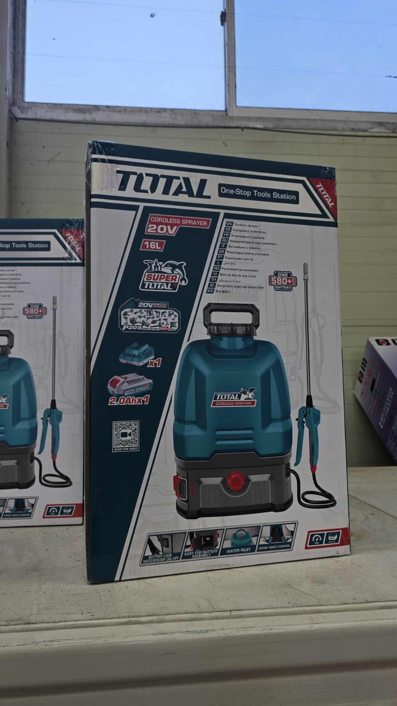
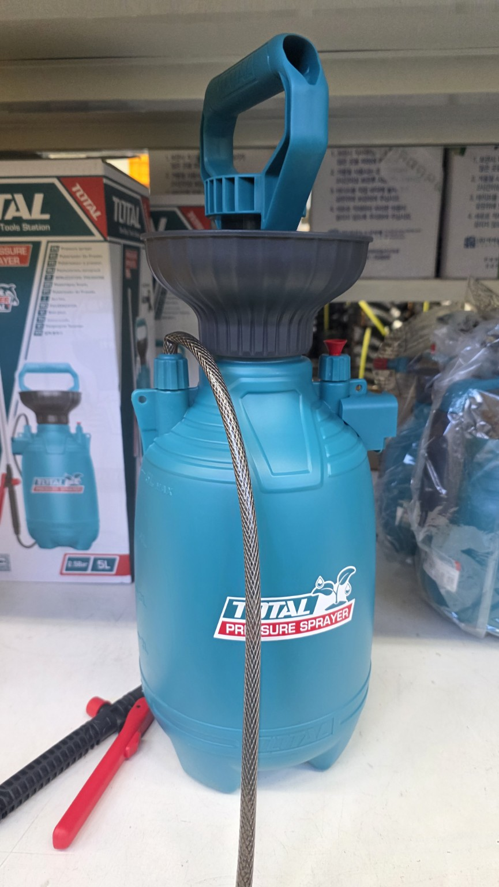
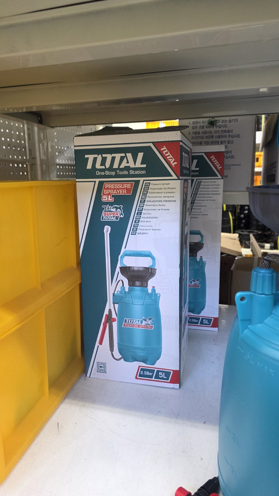
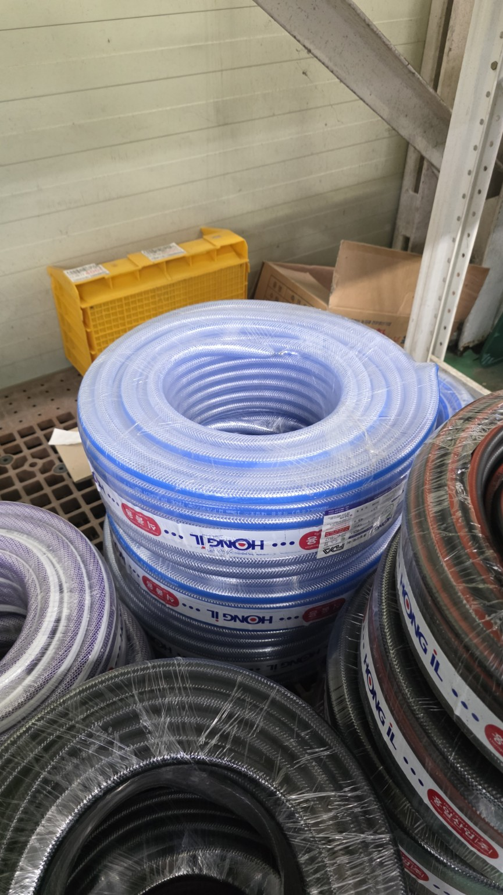
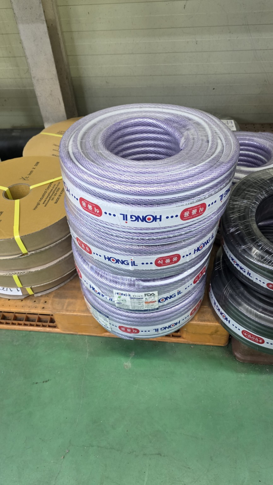

# 화곡농장 분무기·편사호스 사진 정리

- 문서 정리일: 2026-10-04
- 촬영일·구매 여부·가격: 사진만으로 확인되지 않음
- 첨부 이미지: 5장(원본 해상도 865×1536px)

## 확인된 제품

| 구분 | 사진에서 확인되는 정보 | 적합한 용도 | 확인이 더 필요한 사항 |
|---|---|---|---|
| TOTAL 충전식 배낭분무기 | 20V, 16L, 2.0Ah 배터리 1개와 충전기 표시 | 넓은 밭의 제초제·살충제·영양제 살포 | 정확한 모델명, 펌프 압력·유량, 추가 노즐 구성, 판매가격 |
| TOTAL 수동 압축분무기 | 5L, 2.5bar 표시 | 소면적·부분 방제, 농막 주변, 약제 소량 사용 | 정확한 모델명, 패킹·노즐 예비부품, 판매가격 |
| HONG IL 편사호스 | 투명·청색 및 투명 계열 호스 여러 롤 | 급수·세척·분무기 보조 배관 등 | 내경·외경, 길이, 사용압력, 식품·농약용 적합 여부 |

## 선택 판단

| 작업 상황 | 권장 장비 | 판단 이유 |
|---|---|---|
| 들깨밭·클로버밭 등 넓은 면적을 연속 살포 | 16L 충전식 | 펌핑 없이 연속 작업할 수 있어 작업량이 많은 경우 유리 |
| 모종 몇 주, 밭 가장자리, 국소 해충 방제 | 5L 수동식 | 약제를 적게 만들 수 있고 세척·이동이 간단함 |
| 농약과 제초제를 모두 사용할 예정 | 가능하면 분무기 분리 | 잔류 제초제가 작물에 약해를 줄 수 있으므로 전용기를 구분하는 것이 안전함 |

## 구입 전 확인표

1. 16L 충전식은 완충 후 사용시간, 실사용 분사량, 배터리 추가구매 가능 여부를 확인한다.
2. 5L 수동식은 압력이 잘 유지되는지, 안전밸브와 패킹 교체품이 있는지 확인한다.
3. 두 제품 모두 분사봉 길이, 노즐 종류, 호스 연결부 누수 여부를 확인한다.
4. 편사호스는 외관만으로 규격을 확정하지 말고 라벨의 내경·사용압력·길이를 확인한다.
5. 농약 살포 후에는 탱크·호스·노즐을 세척하고 세척수를 수로나 하천에 버리지 않는다.

## 사진 기록

| 1. TOTAL 20V 16L 충전식 분무기 | 2. TOTAL 5L 수동분무기 본체 | 3. TOTAL 5L 수동분무기 포장 |
|---|---|---|
|  |  |  |

| 4. HONG IL 청색 편사호스 | 5. HONG IL 투명 편사호스 |  |
|---|---|---|
|  |  |  |

## 사진별 관찰 내용

| 번호 | 원본 파일 | 내용 |
|---:|---|---|
| 1 | 1000064610.jpg | TOTAL 20V 16L 충전식 배낭분무기 포장. 2.0Ah 배터리 1개와 충전기 구성이 표시됨. |
| 2 | 1000064609.jpg | TOTAL 5L 수동 압축분무기 실물. 상부 펌프 손잡이, 안전밸브로 보이는 적색 부품, 호스와 분사봉 확인. |
| 3 | 1000064608.jpg | TOTAL 5L 수동 압축분무기 포장. 2.5bar 및 5L 표기 확인. |
| 4 | 1000064607.jpg | HONG IL 청색 계열 편사호스 여러 롤. 세부 규격은 라벨 확대 확인 필요. |
| 5 | 1000064606.jpg | HONG IL 투명 계열 편사호스 여러 롤. 일부 라벨에 50으로 보이는 표기가 있으나 단위·규격은 추가 확인 필요. |

> 주의: 사진에 나타난 제품 표시만을 기준으로 정리했다. 정확한 모델명과 호스 규격, 가격 및 실제 구매 여부는 영수증이나 제품 라벨 정면 사진으로 보완해야 한다.
