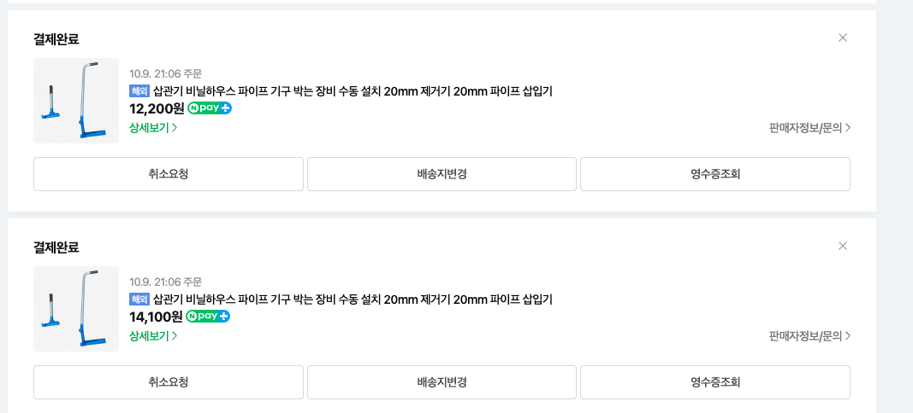
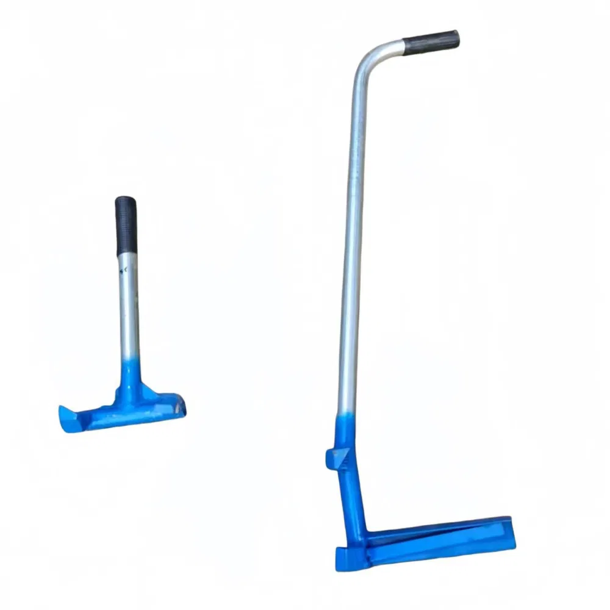

# 20261009 지주대 삽입기 구매기록

기록일: 2026-10-09 · 화곡농장 · 공개 아카이브

## 핵심 요약
네이버 쇼핑에서 지주대 삽입기를 검색하고 가격비교 및 개별 판매상품 링크를 공유했다. 첨부 주문 화면에는 10월 9일 21:06 주문 2건이 결제 완료로 표시된다. 표시 금액은 12,200원과 14,100원, 합계 26,300원이다. 해외 상품이며 배송 완료 여부는 확인되지 않았다.

| 항목 | 확인 내용 |
|---|---|
| 상품명 | 삽관기 비닐하우스 파이프 기구 박는 장비 수동 설치 20mm 제거기 20mm 파이프 삽입기 |
| 첫 주문 표시금액 | 12,200원 |
| 둘째 주문 표시금액 | 14,100원 |
| 표시금액 합계 | 26,300원 |
| 주문 상태 | 결제 완료 |
| 주문 시각 | 2026-10-09 21:06 (화면의 월일·시각과 채팅 연도 기준) |
| 선택 옵션·수량 | 화면에 표시되지 않아 확인 불가 |
| 배송 | 해외 표시, 도착일 미확인 |

## 상품 사진과 미확인 사항
상품 사진에는 왼쪽의 짧은 손잡이형과 오른쪽의 긴 굽은 손잡이형 도구가 함께 보인다. 왼쪽은 제거용, 오른쪽은 삽입용으로 보인다는 설명은 사진 형태에 따른 추정이다. 판매자 상세 설명이 확보되지 않았으므로 기능을 확정하지 않는다.

두 주문이 삽입기와 제거기를 각각 구매한 것인지, 동일 옵션을 두 번 구매한 것인지 확인되지 않았다. 함께 찍힌 사진만으로 세트 구성을 단정할 수 없다. 두 금액을 특정 도구에 배정하지 않는다. 상품명에 20mm가 포함되어 있으나 이것이 호환 파이프 외경인지, 도구 규격인지 확인되지 않았다.

## 확인 순서
1. 각 주문 상세보기에서 선택 옵션명과 수량을 확인한다.
2. 판매자 설명에서 삽입·제거 용도 및 20mm 호환 규격을 확인한다.
3. 사용하려는 지주대의 외경·길이·재질과 대조한다.
4. 실제 사용법은 판매자 안내가 확보된 뒤 판단한다.

## 대화 경과
| 순서 | 내용 |
|---|---|
| 1 | 지주대 삽입기 네이버 쇼핑 검색 링크 공유 |
| 2 | 네이버 상품 가격비교 링크 공유 |
| 3 | 스마트스토어 개별 판매상품 링크 공유 |
| 4 | 주문 결제 완료 화면 첨부, 금액 2건과 합계 확인 |
| 5 | 도구 2종 상품 사진 첨부, 용도 추정과 미확인 옵션 구분 |
| 6 | 아카이브 공개 배포 요청 |

## 원본 이미지

현재 채팅의 실제 첨부 이미지 2장을 바이트 그대로 포함했다. 다른 채팅의 주문자료는 범위에 포함하지 않았다. 사진 속 상품에 대한 선택 옵션·규격 상세는 미확보이며, 네이버 상세페이지를 읽지 못했으므로 판매자 설명을 확인한 것으로 표시하지 않는다.

## 참고 링크
- [네이버 쇼핑 검색](https://search.shopping.naver.com/search/all?query=지주대%20삽입기)
- [네이버 가격비교](https://search.shopping.naver.com/catalog/50539612136)
- [스마트스토어 상품](https://smartstore.naver.com/yumtang/products/13254826938)
- [화곡농장](https://softm.github.io/hwagok-farm/)
- [전체 프로젝트](https://softm.github.io/projects/)
